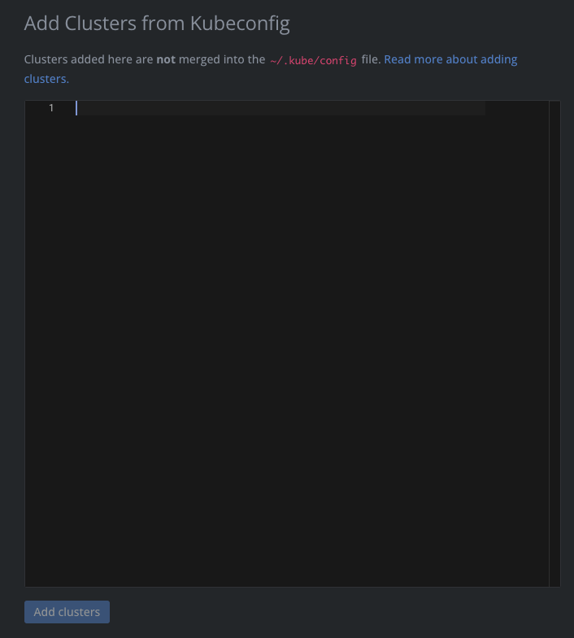
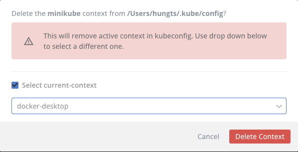
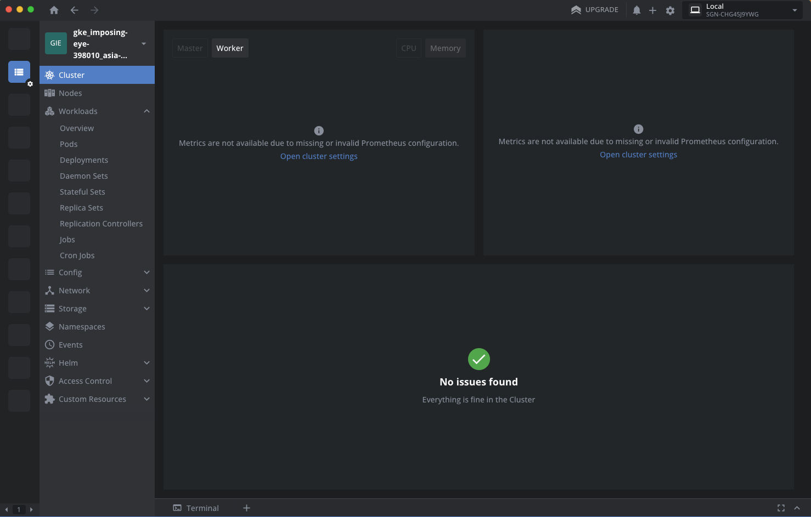
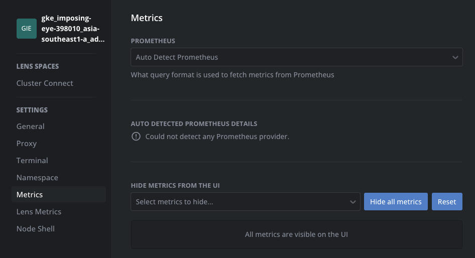
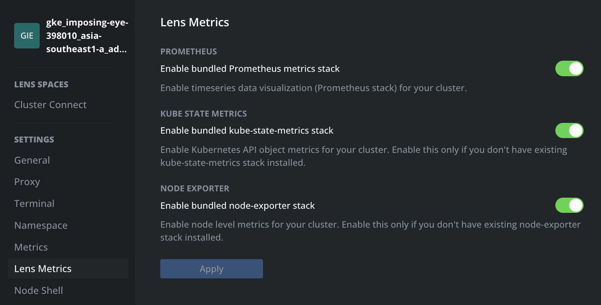
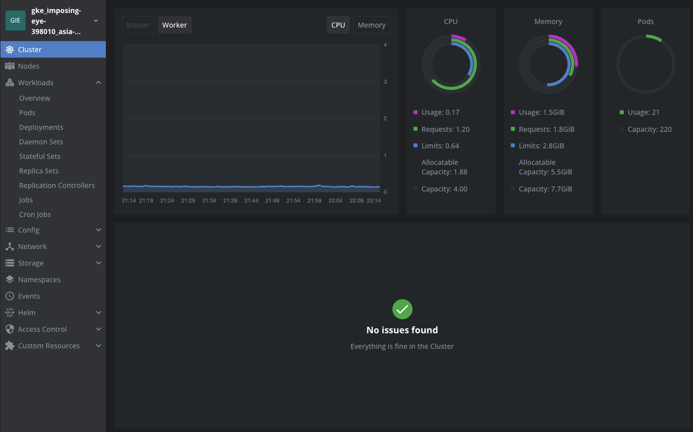

# Monitoring k8s clusters with Lens

## Provisioning your clusters

[ Creating your clusters](../../1-helm/lab3_kubernetes_install/README.md)

## Install Gcloud SDK
### Gcloud DSK
- MacOS: https://cloud.google.com/sdk/docs/install#mac
- Windows: https://cloud.google.com/sdk/docs/install#windows

### GKE plugin
```
gcloud components install kubectl
```

## Adding/Removing clusters to Lens

### Via local kubeconfig file
In most of the case, Lens automatically scan your local kubeconfig file and add/remove clusters on the fly.


### Add clusters in the manual way

- See your current cluster configuration

```
kubectl config view --minify --raw
```

- Add the cluster to Lens




### Remove the cluster from Lens




> [!IMPORTANT]  
> Prior to deleting the cluster from Lens, you must choose your current context.
> Removing the cluster from Lens Desktop does not affect the cluster itself or its configuration.

## Monitoring clusters with Lens

- Connect to your newly created GKE cluster. Oops, no Metrics available!



- Let's fix this with Lens Metric. Hit `Open Cluster settings`



- Since Len cannot detect your Prometheus API (which intentionally disables when provisioning GKE cluster). We will make use of Lens Metrics to enable that.



- Check if Lens Metric pods installed

```
kubectl get po -n lens-metrics

NAME                                  READY   STATUS    RESTARTS   AGE
kube-state-metrics-78c6898fb8-xd4vg   1/1     Running   0          4h28m
node-exporter-2l6vj                   1/1     Running   0          4h35m
node-exporter-48s2b                   1/1     Running   0          4h35m
prometheus-0                          1/1     Running   0          4h35m
```

- Lens should now be capable of monitoring cluster resources.



> [!NOTE]
> If Lens does not identify the Prometheus/Metrics API, we must manually configure it to monitor the cluster.