# Managing and deploying workloads with Lens

## Deploy a deployment using Template

- Deploying a `hello-world` deployment from template

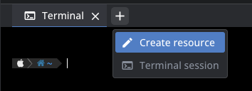


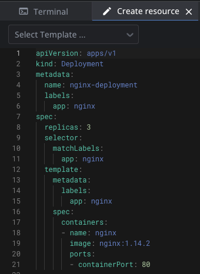


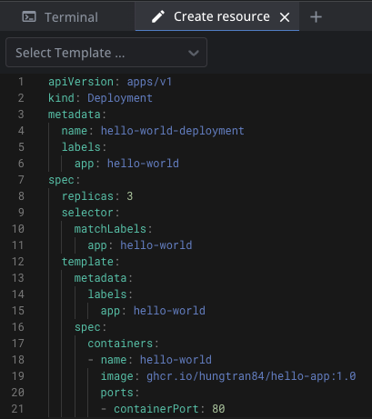

- Hit `Create and Close` to deploy your deployment to the cluster. 3 pods should be up and running after few seconds.


## Deploy your `workpress` with helm chart

- Create namespace

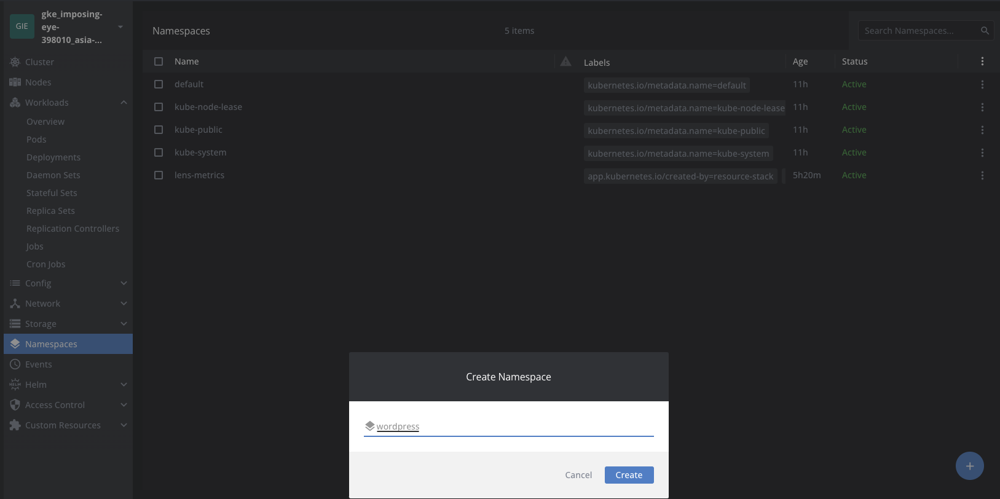

- Go to `Helm -> Charts` and search for `wordpress`


- Pick up the first one and check for further Chart info

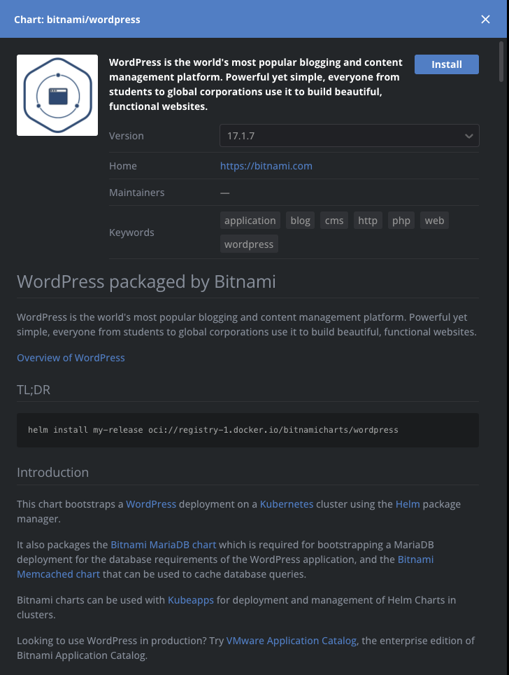

- Hit `Install` and Lens IDE shows up again

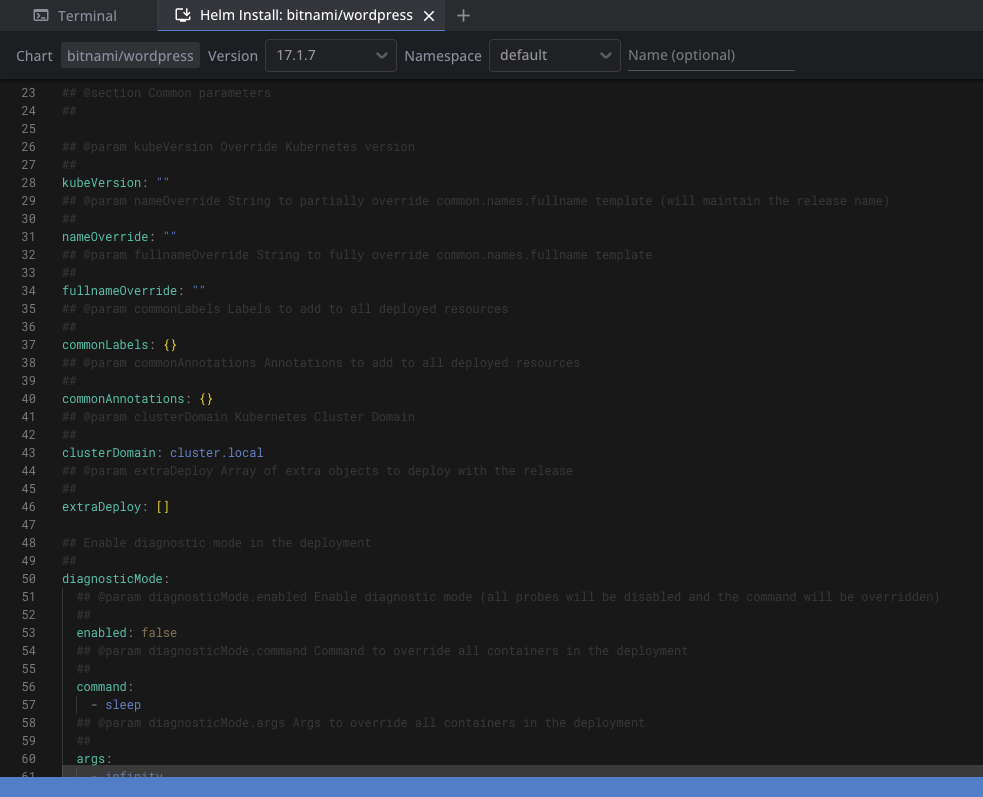

- Modify chart default values as below and hit `Install`


- Check Chart NOTES after installation

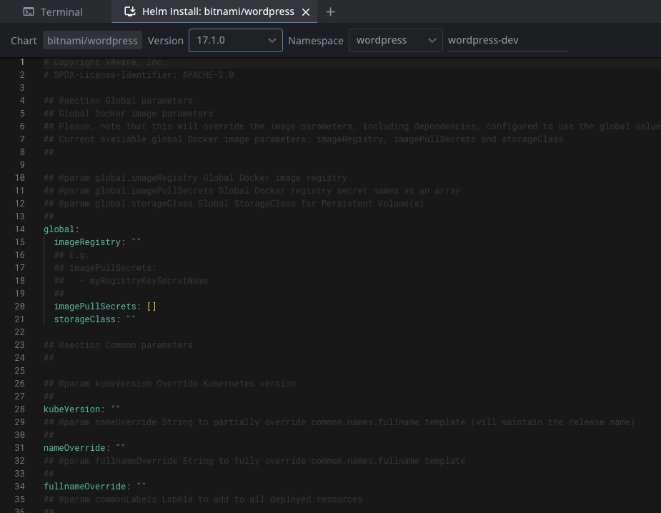

- Get the WordPress URL by running these commands

```shell
export SERVICE_IP=$(kubectl get svc --namespace wordpress wordpress-dev --template "{{ range (index .status.loadBalancer.ingress 0) }}{{ . }}{{ end }}")
echo "WordPress URL: http://$SERVICE_IP/"
echo "WordPress Admin URL: http://$SERVICE_IP/admin"
echo Username: user
echo Password: $(kubectl get secret --namespace wordpress wordpress-dev -o jsonpath="{.data.wordpress-password}" | base64 -d)


Username: user
Password: xxxx
WordPress URL: http://35.240.238.55/
WordPress Admin URL: http://35.240.238.55/admin
```

- Open a browser and access WordPress using the obtained URL

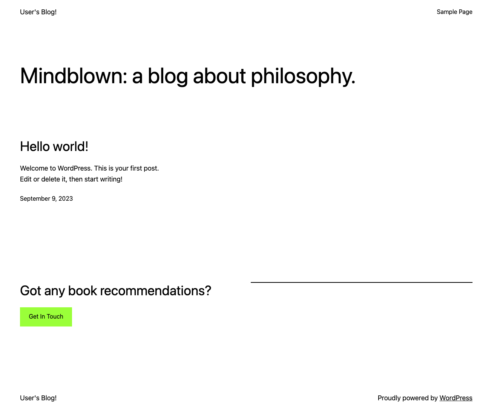

- Login to Wordpress Admin page

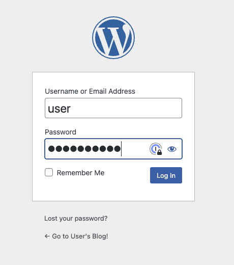

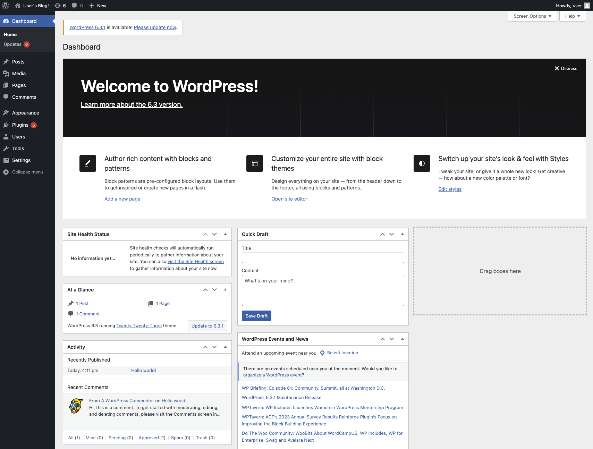

- Cleanup `Wordpress`


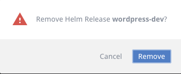
