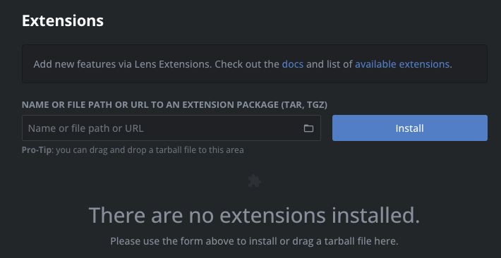
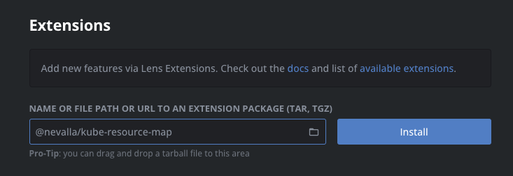
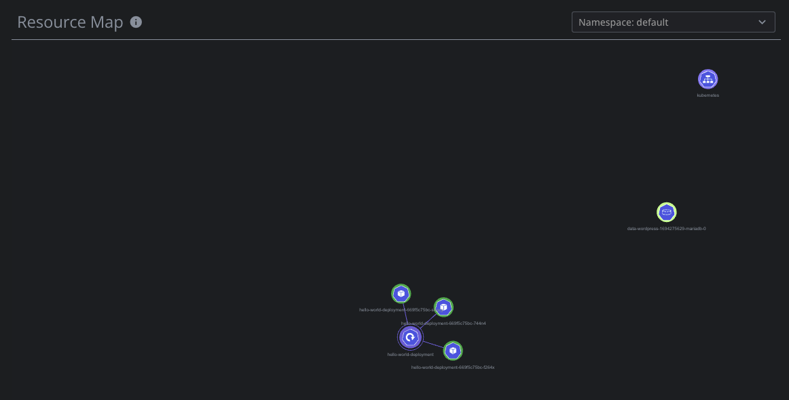

# Developing Lens extension

## Add `Resource Map` extension
- Check the existing extensions

[Len Extenstions](https://github.com/lensapp/lens-extensions)

- Switch to the Extensions view (`CMD+SHIFT+E` on macOS) on Lens.

- Enter `@nevalla/kube-resource-map` into the Install Extension box and hit `Install`.

- Examine `Resource Map` 

## Develop your own extension (coming soon)

