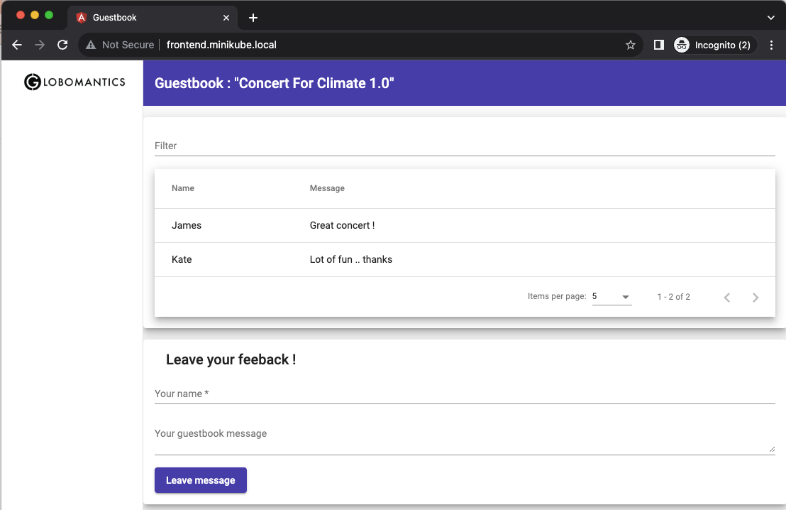
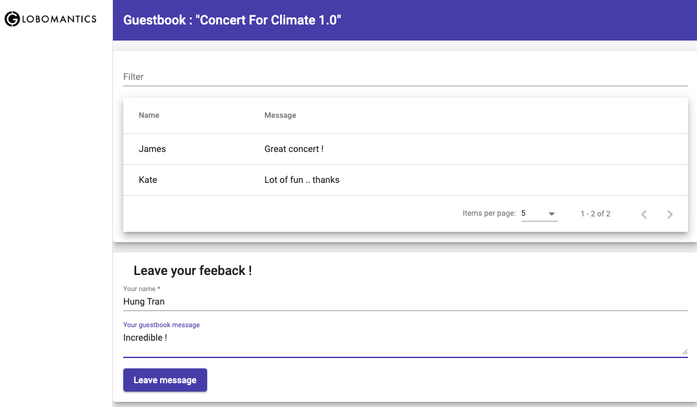
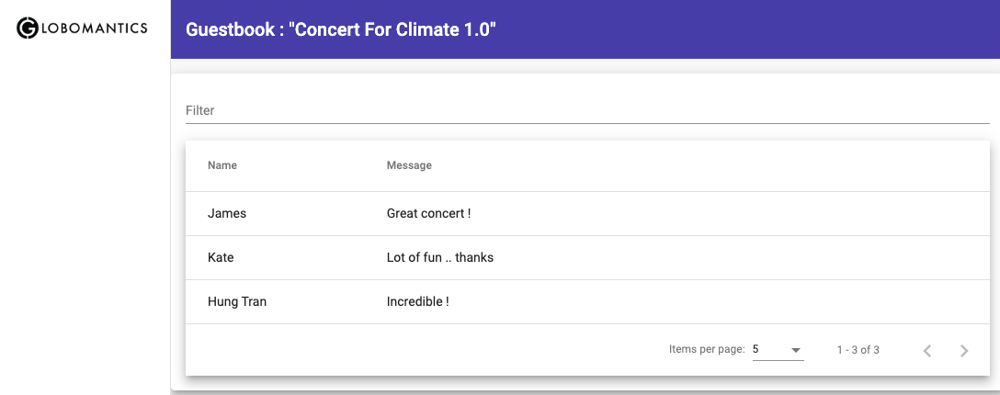

# Deploy `GuestBook` v1

- Start Minikube tunnel

```
minikube tunnel &
```

- Deploy `frontend` application

```
kubectl apply -f frontend.yaml
```

- Expose the application

```
kubectl apply -f frontend-service.yaml
```

- Expose with the ingress

```
kubectl apply -f ingress.yaml
```

- Access the application UI



- Leave your message 



- It works !



