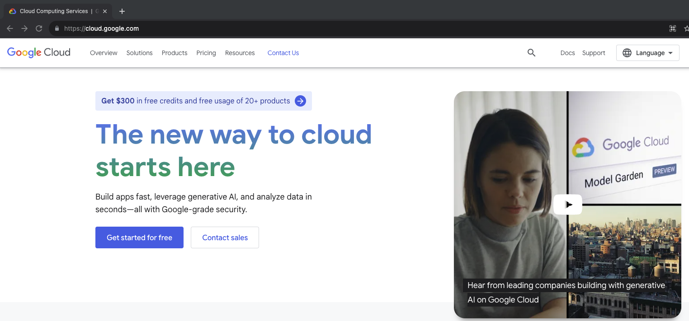
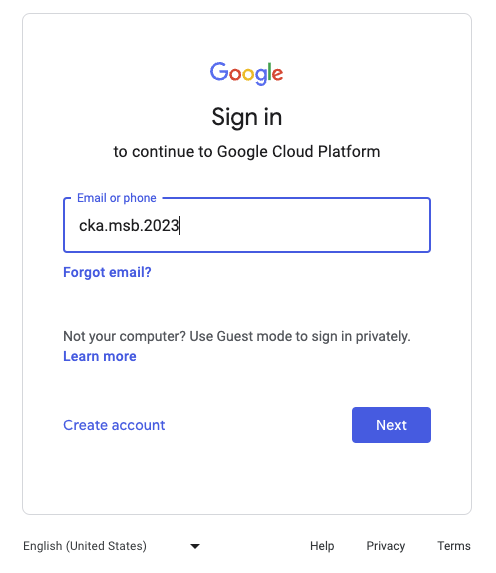
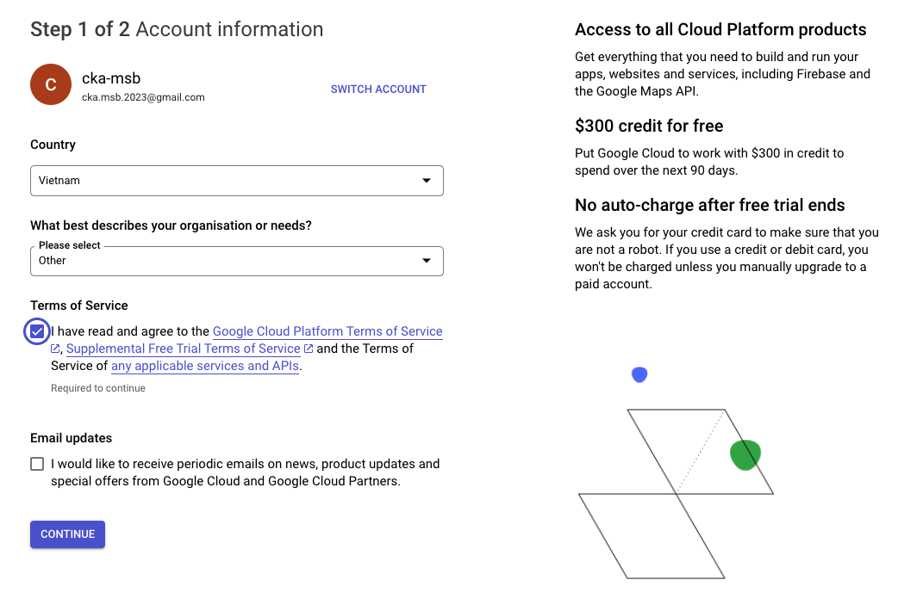
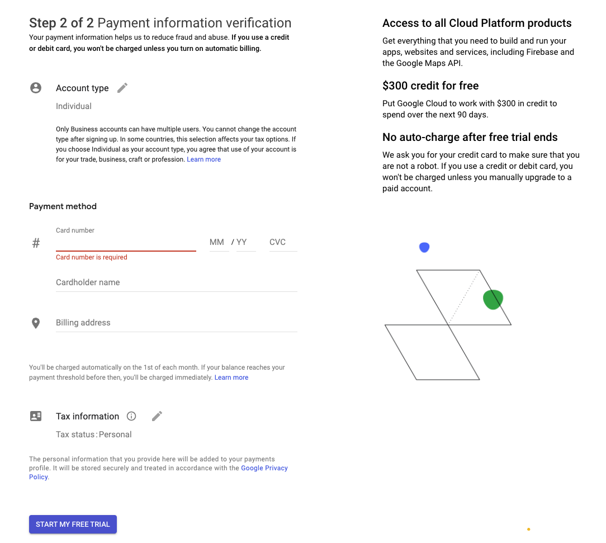
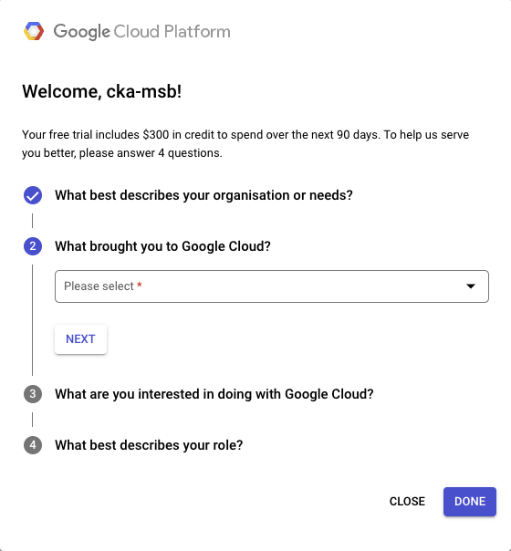
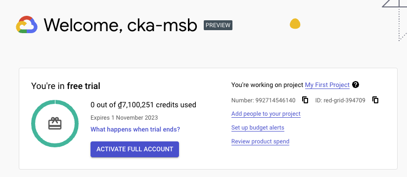

# Lab setup

## 3.1 Minikube
 
### Docker installation check
docker version

### Minikube installation

https://minikube.sigs.k8s.io/docs/start/

```shell
# For MacOS M1
curl -LO https://storage.googleapis.com/minikube/releases/latest/minikube-darwin-arm64
sudo install minikube-darwin-arm64 /usr/local/bin/minikube
minikube version
minikube start
```

### Minikube configuration
```
minikube addons enable ingress
echo "127.0.0.1 frontend.minikube.local" | sudo tee -a /etc/hosts
echo "127.0.0.1 backend.minikube.local" | sudo tee -a /etc/hosts
```

## 3.2 GKE

### Register a GCP Free-Trail account
- Go to cloud.google.com
  


- Enter your gmail or GSuite email



- Accept `Terms of Service`



- Fill the payment information



- Successfully registered Free-tier account with $300



- The first GCP project has automatically created for you with the name `My First Project`



> [!IMPORTANT]  
> DO NOT hit `ACTIVATE FULL ACCOUNT` button above to avoid any additional fee!
### Create a basic GKE cluster with minimal add-ons
- Setup your gcloud project configuration
```
$ gcloud config configurations create tokp01

$ gcloud init


Pick configuration to use:
 [1] Re-initialize this configuration [tokp01] with new settings 
 [2] Create a new configuration
 [3] Switch to and re-initialize existing configuration: [default]
Please enter your numeric choice:  1

Your current configuration has been set to: [tokp01]

You can skip diagnostics next time by using the following flag:
  gcloud init --skip-diagnostics

Network diagnostic detects and fixes local network connection issues.
Checking network connection...done.                                                                                                                                                              
Reachability Check passed.
Network diagnostic passed (1/1 checks passed).

Choose the account you would like to use to perform operations for this configuration:
 [1] cka.msb.2023@gmail.com
 [2] tokp1009@gmail.com
 [3] Log in with a new account
Please enter your numeric choice:  2

You are logged in as: [tokp1009@gmail.com].

Pick cloud project to use: 
 [1] imposing-eye-398010
 [2] Enter a project ID
 [3] Create a new project
Please enter numeric choice or text value (must exactly match list item):  1

Your current project has been set to: [imposing-eye-398010].

```

- Enable Kubernetes Engine API

```
gcloud services enable container.googleapis.com
```
```
gcloud container clusters create "adv-k8s-cluster" \
        --zone "asia-southeast1-a" \
        --cluster-version "1.27.3-gke.100" \
        --release-channel "None" \
        --machine-type "e2-medium" \
        --num-nodes "2" \
        --cluster-dns=clouddns --cluster-dns-scope=cluster \
        --no-enable-master-authorized-networks \
        --no-enable-autoupgrade \
        --no-enable-managed-prometheus
```

- Get GKE credential

```
gcloud container clusters get-credentials adv-k8s-cluster --zone asia-southeast1-a
```

- Delete our GKE cluster if needed
```
gcloud container clusters delete adv-k8s-cluster --zone asia-southeast1-a -q
```