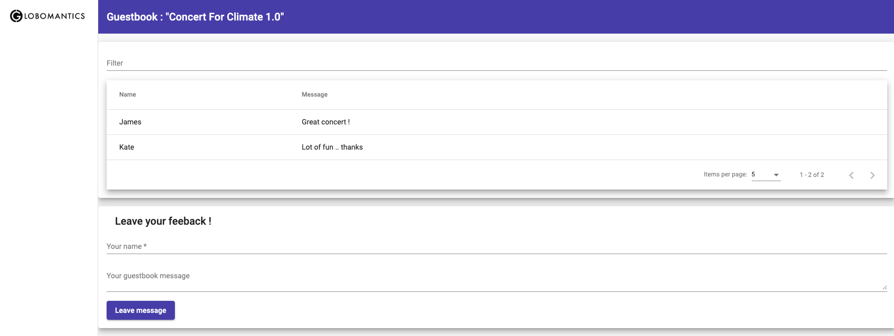

# Developing, Installing/Updgrading, Rolling back and Deleting a helm chart
 
## Building helm chart from scratch

- Create chart directory and templates
```shell
mkdir guestbook
mkdir -p guestbook/templates
cp 1-helm/lab5_helm_chart_version1/yaml/* guestbook/templates
```

- Create `Chart.yaml`

```yaml
# vim guestbook/Chart.yaml
apiVersion: v2
name: guestbook
appVersion: "1.0"
description: A Helm chart for Guestbook 1.0 
version: 0.1.0
type: application
```

- Render chart templates locally and display the output.

```shell
helm template guestbook 
```

## Install a chart

- Install `guestbook` chart

```
helm install demo-guestbook guestbook

NAME: demo-guestbook
LAST DEPLOYED: Sat Sep 16 16:57:11 2023
NAMESPACE: default
STATUS: deployed
REVISION: 1
TEST SUITE: None
```

- Get the `frontend` pods

```
kubectl get pod -l app=frontend

NAME                        READY   STATUS    RESTARTS   AGE
frontend-5548f6f498-vvzjs   1/1     Running   0          20m
```

- List all of the releases for a specified namespace (uses current namespace context if namespace not specified)

```
helm list

NAME            NAMESPACE       REVISION        UPDATED                                 STATUS          CHART           APP VERSION
demo-guestbook  default         1               2023-09-16 16:57:11.664022 +0700 +07    deployed        guestbook-0.1.0 1.0        
```

- Fetch the generated manifest for `demo-guestbook` release

```
helm get manifest demo-guestbook
```

- Examine the ingress resource and get the external IP address

```
kubectl get ingress guestbook-ingress

NAME                CLASS   HOSTS                                  ADDRESS        PORTS   AGE
guestbook-ingress   nginx   frontend.gke.local,backend.gke.local   34.87.76.196   80      32m
```

```
EXTERNAL_IP=$(kubectl get ingress guestbook-ingress -o jsonpath='{.status.loadBalancer.ingress[0].ip}')
```

- Set local host file

```
echo "$EXTERNAL_IP frontend.gke.local" | sudo tee -a /etc/hosts
echo "$EXTERNAL_IP backend.gke.local" | sudo tee -a /etc/hosts
```

- Access the frontend Web UI at http://frontend.gke.local

