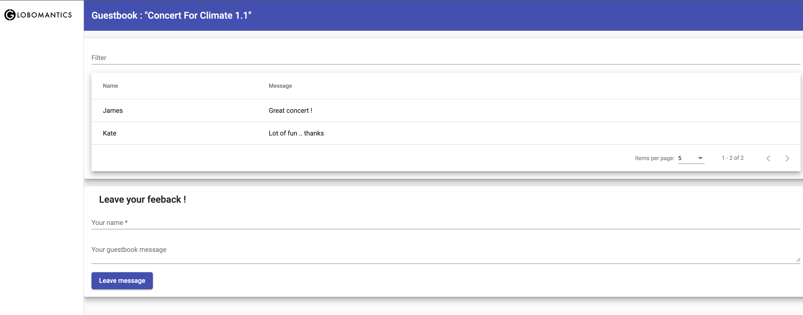

# Developing, Installing/Updgrading, Rolling back and Deleting a helm chart
 
## Building helm chart from scratch

- Create chart directory and templates
```shell
mkdir guestbook
mkdir -p guestbook/templates
cp 1-helm/lab5_helm_chart_version1/yaml/* guestbook/templates
```

- Create `Chart.yaml`

```yaml
# vim guestbook/Chart.yaml
apiVersion: v2
name: guestbook
appVersion: "1.0"
description: A Helm chart for Guestbook 1.0 
version: 0.1.0
type: application
```

- Render chart templates locally and display the output.

```shell
helm template guestbook 
```

## Install a chart

- Install `guestbook` chart

```
helm install demo-guestbook guestbook

NAME: demo-guestbook
LAST DEPLOYED: Sat Sep 16 16:57:11 2023
NAMESPACE: default
STATUS: deployed
REVISION: 1
TEST SUITE: None
```

- Get the `frontend` pods

```
kubectl get pod -l app=frontend

NAME                        READY   STATUS    RESTARTS   AGE
frontend-5548f6f498-vvzjs   1/1     Running   0          20m
```

- List all of the releases for a specified namespace (uses current namespace context if namespace not specified)

```
helm list

NAME            NAMESPACE       REVISION        UPDATED                                 STATUS          CHART           APP VERSION
demo-guestbook  default         1               2023-09-16 16:57:11.664022 +0700 +07    deployed        guestbook-0.1.0 1.0        
```

- Fetch the generated manifest for `demo-guestbook` release

```
helm get manifest demo-guestbook
```

- Examine the ingress resource and get the external IP address

```
kubectl get ingress guestbook-ingress

NAME                CLASS   HOSTS                                  ADDRESS        PORTS   AGE
guestbook-ingress   nginx   frontend.gke.local,backend.gke.local   34.87.76.196   80      32m
```

```
EXTERNAL_IP=$(kubectl get ingress guestbook-ingress -o jsonpath='{.status.loadBalancer.ingress[0].ip}')
```

- Set local host file

```
echo "$EXTERNAL_IP frontend.gke.local" | sudo tee -a /etc/hosts
echo "$EXTERNAL_IP backend.gke.local" | sudo tee -a /etc/hosts
```

- Access the frontend Web UI at http://frontend.gke.local


- Upgrade helm chart

```yaml
# vim guestbook/Chart.yaml
apiVersion: v2
name: guestbook
appVersion: "1.1"
description: A Helm chart for Guestbook 1.1 
version: 0.1.0
type: application
```

```yaml
vim guestbook/templates/frontend.yaml
apiVersion: apps/v1
kind: Deployment
metadata:
  name: frontend
spec:
  replicas: 1
  selector:
    matchLabels:
      app: frontend 
  template:
    metadata:
      labels:
        app: frontend
    spec:
      containers:
      - image: ghcr.io/hungtran84/frontend:1.1
        imagePullPolicy: Always
        name: frontend
        ports:
        - name: frontend
          containerPort: 4200
```

```shell
❯ helm upgrade demo-guestbook guestbook

Release "demo-guestbook" has been upgraded. Happy Helming!
NAME: demo-guestbook
LAST DEPLOYED: Mon Sep 18 23:18:19 2023
NAMESPACE: default
STATUS: deployed
REVISION: 2
TEST SUITE: None
```

- Check the new image of frontend application

```
kubectl describe pod -l app=frontend
Name:             frontend-5cb77cc84c-x2s9n
Namespace:        default
Priority:         0
Service Account:  default
Node:             gke-adv-k8s-cluster-default-pool-73aa0ae2-vg4t/10.148.0.11
Start Time:       Mon, 18 Sep 2023 23:18:20 +0700
Labels:           app=frontend
                  pod-template-hash=5cb77cc84c
Annotations:      <none>
Status:           Running
IP:               10.12.0.29
IPs:
  IP:           10.12.0.29
Controlled By:  ReplicaSet/frontend-5cb77cc84c
Containers:
  frontend:
    Container ID:   containerd://15f8964d37e1e9bf5b5c37c7a767c5b7900d8ba558ca4c947695b1f1d2b25e92
    Image:          ghcr.io/hungtran84/frontend:1.1
    Image ID:       ghcr.io/hungtran84/frontend@sha256:de0a440d2de76f394f53ca537eb0b8bffb0fa7b6fc28cc74bed2dc98b64c36ec
    Port:           4200/TCP
    Host Port:      0/TCP
    State:          Running
      Started:      Mon, 18 Sep 2023 23:18:24 +0700
    Ready:          True
    Restart Count:  0
    Environment:    <none>
    Mounts:
      /var/run/secrets/kubernetes.io/serviceaccount from kube-api-access-knzhx (ro)
Conditions:
  Type              Status
  Initialized       True 
  Ready             True 
  ContainersReady   True 
  PodScheduled      True 
Volumes:
  kube-api-access-knzhx:
    Type:                    Projected (a volume that contains injected data from multiple sources)
    TokenExpirationSeconds:  3607
    ConfigMapName:           kube-root-ca.crt
    ConfigMapOptional:       <nil>
    DownwardAPI:             true
QoS Class:                   BestEffort
Node-Selectors:              <none>
Tolerations:                 node.kubernetes.io/not-ready:NoExecute op=Exists for 300s
                             node.kubernetes.io/unreachable:NoExecute op=Exists for 300s
Events:
  Type    Reason     Age   From               Message
  ----    ------     ----  ----               -------
  Normal  Scheduled  106s  default-scheduler  Successfully assigned default/frontend-5cb77cc84c-x2s9n to gke-adv-k8s-cluster-default-pool-73aa0ae2-vg4t
  Normal  Pulling    106s  kubelet            Pulling image "ghcr.io/hungtran84/frontend:1.1"
  Normal  Pulled     103s  kubelet            Successfully pulled image "ghcr.io/hungtran84/frontend:1.1" in 3.054884829s (3.054911609s including waiting)
  Normal  Created    103s  kubelet            Created container frontend
  Normal  Started    103s  kubelet            Started container frontend
```

- Check the status of helm release

```
❯ helm status demo-guestbook

NAME: demo-guestbook
LAST DEPLOYED: Mon Sep 18 23:18:19 2023
NAMESPACE: default
STATUS: deployed
REVISION: 2
TEST SUITE: None
```

- Refresh browser to see the new version deployed



- Rollback the earlier revision

```
helm rollback demo-guestbook 1

Rollback was a success! Happy Helming!
```

- Get history of all the changes

```
❯ helm history demo-guestbook

REVISION        UPDATED                         STATUS          CHART           APP VERSION     DESCRIPTION     
1               Mon Sep 18 23:12:36 2023        superseded      guestbook-0.1.0 1.0             Install complete
2               Mon Sep 18 23:18:19 2023        superseded      guestbook-0.1.0 1.1             Upgrade complete
3               Mon Sep 18 23:24:14 2023        deployed        guestbook-0.1.0 1.0             Rollback to 1   
```
- Cleanup helm release

```
helm uninstall demo-guestbook
rm -rf guestbook
```