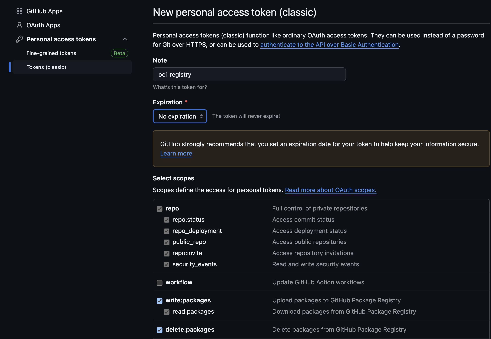
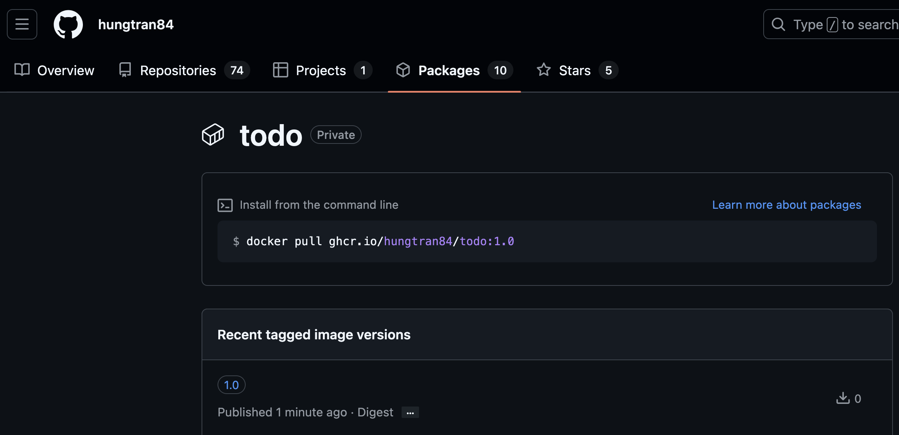
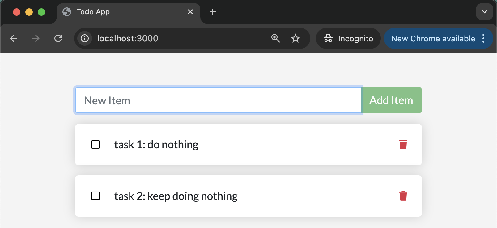

# PURPOSE

The purpose of this exercise is to get familiar with the 'todo' list app that will be used throughout the course. The simple app is based on the [Express web framework](https://expressjs.com/), has a pluggable database for persistence, and is designed to be run in containerized form.

# REQUIREMENTS

The exercise requires a working Docker installation for building a container image and for testing the application prior to its deployment to Kubernetes. Docker can be obtained through a variety of means, including [Docker Desktop](https://docs.docker.com/get-docker/), and through native OS package managers ([Docker Install](https://docs.docker.com/engine/install/)). An account with an OCI registry is also required, such as [Docker Hub](https://hub.docker.com/) or the [GitHub Container Registry](https://github.com/features/packages), or any of the public cloud providers. A Kubernetes cluster is required for deploying the application.

# Prerequisite Steps to Create `ghcr.io` OCI Registry

## 1. **GitHub Account**
   Ensure you have a GitHub account. If not, sign up for one at [github.com](https://github.com).

## 2. **GitHub Personal Access Token (PAT)**
   To authenticate against `ghcr.io`, you need a GitHub Personal Access Token (PAT) with the appropriate permissions.

   ### Steps to Create a Personal Access Token:
   1. Go to your GitHub account [Settings](https://github.com/settings/profile).
   2. Navigate to **Developer settings** > **Personal access tokens** > **Fine-grained tokens**.
   3. Click **Generate new token**.
   4. Under **Select Scopes**, ensure you select:
      - `read:packages` (To pull images)
      - `write:packages` (To push images)
      - `delete:packages` (Optional, if you need to delete images)
      - `repo` (Optional, if you want to access private repositories)

      
   5. Save the token in a secure place as it will be shown only once.

## 3. **Docker Installed**
   Ensure that Docker is installed on your local machine. If not, you can download and install it from [Docker's official site](https://docs.docker.com/get-docker/).

   After installation, confirm Docker is working by running:
   ```bash
   docker --version
   ```
## Use the Personal Access Token (PAT) to Log In to GitHub Container Registry via Docker

To authenticate Docker with GitHub Container Registry, use your GitHub Personal Access Token (PAT).

### Docker Login Command:
Run the following command, replacing `YOUR_GITHUB_USERNAME` with your GitHub username and `YOUR_GITHUB_TOKEN` with the PAT you generated earlier:

```bash
echo YOUR_GITHUB_TOKEN | docker login ghcr.io -u YOUR_GITHUB_USERNAME --password-stdin
```
If the login is successful, you should see:
```t
Login Succeeded
```

Push chart to GHCR
```sh
helm push example-chart-${CHART_VERSION}.tgz oci://ghcr.io/YOUR_GITHUB_USERNAME
```

# STEPS

1. **Get some familiarity with the application.**

    ```bash
    cd app
    ls -lR
    cat Dockerfile
    ```

2. **Build a container image for the application.** Be sure to tag your image so that it can be pushed to the OCI registry of your choice.

    ```bash
    docker build -t ghcr.io/username/todo:1.0 .
    ```

3. **Push the image to your chosen OCI registry, remembering to login first.**

    ```bash
    docker push ghcr.io/username/todo:1.0
    ```
    

4. **Check the application works by running a container.**

    ```bash
    docker run -it --rm \
      -e SQLITE_DB_LOCATION=/tmp/todos.db \
      -p 3000:3000 \
      ghcr.io/username/todo:1.0
    ```

    Use a web browser to consume the app using the URL [localhost:3000](http://localhost:3000).

    

5. **Get some familiarity with the Kubernetes configuration for the application.**

    ```bash
    cd ../config
    cat deployment.yaml
    cat service.yaml
    ```

6. **Modify the Deployment definition to reference the image you have built, i.e.**

    ```yaml
    - image: ghcr.io/username/todo:1.0
    ```

7. **Depending on the OCI registry you have chosen to use for your image (and whether it's a public or private repo), you may need to create a secret for the credentials to authenticate. If so, create a Kubernetes secret containing your registry login credentials. If not, don't worry about the secret and be sure to amend the deployment definition to remove the `imagePullSecrets` section.**

    ```bash
    kubectl create secret docker-registry my-secret \
    --docker-server=ghcr.io \
    --docker-username=YOUR_GITHUB_USERNAME \
    --docker-password=YOUR_GITHUB_TOKEN \
    --docker-email=your-email@example.com
    ```

8. **Deploy the application to the cluster.**

    ```bash
    kubectl apply -f .
    ```

9. **Check the application is running as expected.** Make a note of the external IP address of the Service, and use this to consume the app in a web browser. Use `kubectl port-forward` if there is no external IP address assigned to the Service.

    ```bash
    kubectl port-forward services/todo 8888:3000
    ```

That's it! The 'todo' app should be running in the cluster using SQLite as the persistence layer.
