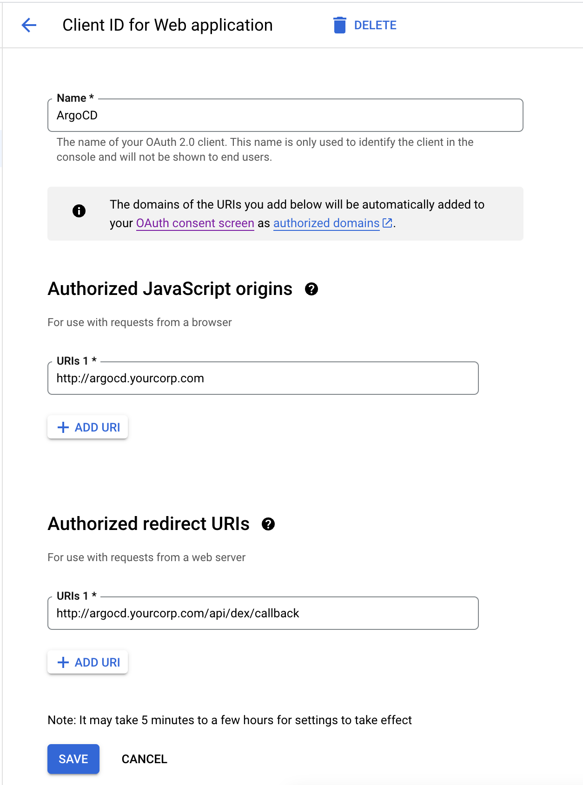
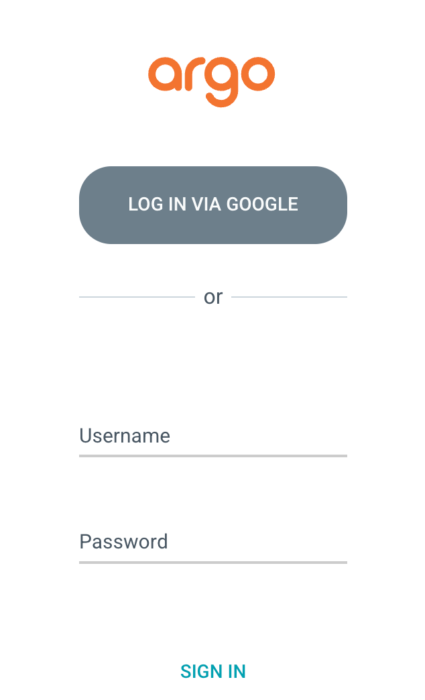

# Prerequisites
The following tools need to be installed:
- Kubectl 
- Yq (https://github.com/mikefarah/yq#install)

# 1. Create Google OAuth2 client
In your [Google Cloud Console](https://console.cloud.google.com), go to to the [“API & services”](https://console.cloud.google.com/apis), [credentials](https://console.cloud.google.com/apis/credentials) sub menu and create a new Oauth2 client ID. Fill in the fields as follows:




Take note the `Client ID` and `Client Secret` to use in the next step

# 2. Backup the current `argocd-cm` configMap
```
kubectl get configmap argocd-cm -n argocd -o yaml | yq eval 'del(.metadata.resourceVersion, .metadata.uid, .metadata.annotations, .metadata.creationTimestamp, .metadata.selfLink, .metadata.managedFields)' - > argocd-cm.yaml
```

The `yq` help us to remove unnecessary information out of the yaml file, so that our file will be export in the original format.

# 3. Update `argocd-cm` configMap
Modify the `argocd-cm.yaml` with the following configuration to enable Google SSO
```
apiVersion: v1
data:
  accounts.alice: apiKey, login
  admin.enabled: "true"
  application.instanceLabelKey: argocd.argoproj.io/instance
  exec.enabled: "false"
  server.rbac.log.enforce.enable: "false"
  timeout.hard.reconciliation: 0s
  timeout.reconciliation: 180s
  dex.config: |
    connectors:
    - config:
        issuer: https://accounts.google.com
        clientID: <YOUR CLIENT ID>
        clientSecret: <YOUR CLIENT SECRET>
      type: oidc
      id: google
      name: Google
  url: http://argocd.yourcorp.com
kind: ConfigMap
metadata:
  labels:
    app.kubernetes.io/component: server
    app.kubernetes.io/instance: argocd
    app.kubernetes.io/managed-by: Helm
    app.kubernetes.io/name: argocd-cm
    app.kubernetes.io/part-of: argocd
    app.kubernetes.io/version: v2.6.6
    helm.sh/chart: argo-cd-5.46.5
  name: argocd-cm
  namespace: argocd
```

# 4. Apply the updated `argocd-cm` configMap
```
kubectl apply -f argocd-cm.yaml
```

# 5. RBAC for Google account
Add the following policy to the `argocd-rbac-cm` to assign the built-in role admin to your Google account
```
g, <your_gmail>, role:admin
```

Add `scopes: '[email, group]'` to the `argocd-rbac-cm` also to get email as scope

The file will look like this
```
apiVersion: v1
data:
  policy.csv: |
    p, role:developers, applications, *, */*, allow
    p, role:developers, applicationsets, *, */*, allow
    p, role:developers, repositories, get, *, allow
    p, role:developers, repositories, create, *, allow
    p, role:developers, repositories, update, *, allow
    p, role:developers, repositories, delete, *, allow
    p, role:developers, projects, get, *, allow
    p, role:developers, projects, create, *, allow
    p, role:developers, projects, update, *, allow
    p, role:developers, projects, delete, *, allow
    p, role:developers, logs, get, *, allow
    g, alice, role:developers
    g, <your_account>@gmail.com, role:admin
  policy.default: ""
  scopes: '[email, group]'
kind: ConfigMap
metadata:
  labels:
    app.kubernetes.io/component: server
    app.kubernetes.io/instance: argocd
    app.kubernetes.io/managed-by: Helm
    app.kubernetes.io/name: argocd-rbac-cm
    app.kubernetes.io/part-of: argocd
    app.kubernetes.io/version: v2.6.6
    helm.sh/chart: argo-cd-5.46.5
  name: argocd-rbac-cm
  namespace: argocd
```

# 5. Update custom domain
Since the ArgoCD is not exposed to the external and the domain `argocd.yourcorp.com` is a custom local domain that we are not own it. So we can use a trick with `/etc/hosts` to map a local domain 

Open `/etc/host` with `root` and update with the following valuee
```
127.0.0.1		localhost
255.255.255.255		broadcasthost
127.0.0.1		argocd.yourcorp.com
::1                          localhost
```

Try to ping the domain to make sure we can resolve the `127.0.0.1` ip address
```
ping argocd.yourcorp.com


PING argocd.lab.com (127.0.0.1): 56 data bytes
64 bytes from 127.0.0.1: icmp_seq=0 ttl=64 time=0.103 ms
64 bytes from 127.0.0.1: icmp_seq=1 ttl=64 time=0.329 ms
64 bytes from 127.0.0.1: icmp_seq=2 ttl=64 time=0.200 ms
64 bytes from 127.0.0.1: icmp_seq=3 ttl=64 time=0.250 ms
...
```

# 6. Visit the ArgoCD UI
## a) Port Forwarding
Since our ArgoCD instance is still not public to the outside via any method, we need to do the port-forward it to our localhost to access it
```
sudo kubectl port-forward svc/argocd-server -n argocd 80:80
```

### b) Access ArgoCD Web UI
Open the web browser and enter the following address to access the ArgoCD Web UI
```
http://argocd.yourcorp.com
```

You will now have a nice `LOGIN WITH GOOGLE` button on the login screen like this



Click it and login as your Google account

### c) Check the RBAC with your Google account
Goes to Settings --> Clusters
  - Result: See the `in-cluster`
  - Reason: You are the admin

Goes to Settings --> Repository certificates and known hosts
  - Result: See all the known hosts
  - Reason: You are the admin