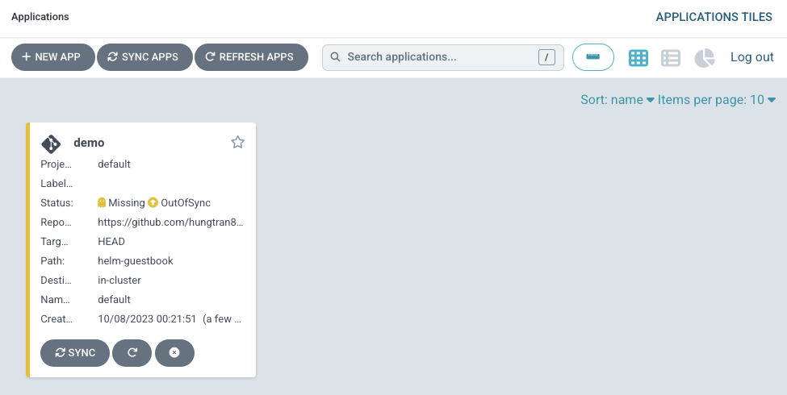

# Play with ArgoCD UI
## ArgoCD User interface
Login in the UI tab.

The UI starts empty because nothing is deployed on our cluster. Click the ***New app*** button on the top left and fill the following details:

```t
Application Name : demo  
Project: default  
Eepository URL: https://github.com/hungtran84/argocd-example-app.git  
Path: helm-guestbook  
Cluster: https://kubernetes.default.svc   
Namespace: default   
```

Leave all the other values empty or with default selections. Finally click the ***Create*** button. The application entry will appear in the main dashboard. Click on it. 


Congratulations! Your have setup your first application with GitOps.


However if you check your cluster with
```
kubectl get deployments
```
You will see that nothing is deployed yet. The cluster is still empty. The `Out of sync` message means essentially this:

- The cluster is empty
- The Git repository has an application
- The Git state and the cluster state are different.

## Syncing an app
We have created our application in ArgoCD, but it is still not deployed as it only exists in Git right now. We need to tell ArgoCD to make the Git state equal to the cluster state.

Visit the ArgoCD UI tab and click on your application to see all the details.Click the `Sync` button and leave all the default options in all choices. Finally click the `Synchronize` button at the top.

ArgoCD sees that the cluster is empty and it will deploy your application in order to make the cluster have the same state as what is in Git.

Eventually, ArgoCD App is in `Synced` and `Healthy` as expected.

Check your deployment again

```sh
kubectl get deployments
NAME                  READY   UP-TO-DATE   AVAILABLE   AGE
demo-helm-guestbook   1/1     1            1           72s
```

Then, check the helm release
```
helm ls
NAME    NAMESPACE       REVISION        UPDATED STATUS  CHART   APP VERSION
```

No helm release is installed. Why?

> [!NOTE]
> 
> When deploying a Helm application ArgoCD is using Helm only as a template mechanism. 
> It runs helm template and then deploys the resulting manifests on the cluster instead of doing helm install. 
> This means that you cannot use any Helm command to view/verify the application. 
> It is fully managed by ArgoCD. Note that ArgoCD supports natively some capabilities that you might miss in Helm (such as the history and rollback commands).
> 
> This decision was made so that ArgoCD is neutral to all manifest generators.