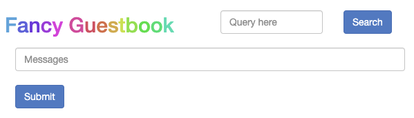
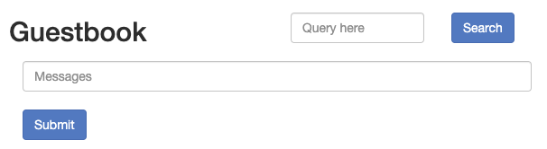

# Auto-sync
## Requirement
- Student fork the `argocd-example-apps` to their own repo.
- Create new branch from `master` called `lab4`

    ```sh
    git checkout -b lab4
    git push
    ```
## Deploy app using ArgoCD UI
Login in the UI tab.

The UI starts empty because nothing is deployed on our cluster. Click the "New app" button on the top left and fill the following details:

```t
application name : demo  
project: default  
SYNC POLICY: automatic  
repository URL: https://github.com/<your user>/argocd-example-apps.git
Target Revision: lab4
path: guestbook  
Cluster: https://kubernetes.default.svc
Namespace: default  
```
Leave all the other values empty or with default selections. Finally click the Create button. The application entry will appear in the main dashboard. Click on it. 

Since we have selected the auto-sync strategy, ArgoCD will autodeploy the application right away (because the cluster state is not the same as the commit state)

You can also verify the application from the command line with:
```
kubectl get deployments
```

## Deploy a new version with AutoSync
If you look at `APP DETAILS` --> `demo` --> `guestbook-ui` you will see that our application is at version `1.0`

We want to deploy another version of our application. We will change the Git and see how ArgoCD detects the change and automatically deploys (since we have set sync strategy to auto).

Perform a commit in your `guestbook-ui-deployment.yaml` file in your own repo and change the container tag at line 17 from `:0.1` to `:0.2`

Normally ArgoCD checks the state between Git and the cluster every 3 minutes on its own. Just to speed things up you should click manually on the application in the ArgoCD dashboard and press the "Refresh" button.

You should see the newer version of application from its UI



Let's rollback to the earlier version using Git
```sh
$ git log
commit d90dd7ba09926fcd165a07a910fbdd5255718b68 (HEAD -> lab4, origin/lab4)
Author: hungts <hungts@axon.com>
Date:   Sun Oct 8 01:21:11 2023 +0700

    feat: upgrade app

commit d263a2490c32575027c5808df1fcda82ddc1a117 (origin/master, origin/develop, master, develop)
Author: hungts <hungts@axon.com>
Date:   Sat Oct 7 23:55:58 2023 +0700

    add labs

$ git revert d90dd7ba09926fcd165a07a910fbdd5255718b68
[lab4 d2d4724] Revert "feat: upgrade app"
 1 file changed, 1 insertion(+), 1 deletion(-)

$ git push

```

Check your `Guestbook` UI.



Tada! Now it is back to `0.1` version.


## Enabling self-heal
Autosync will automatically deploy your application as soon as the Git repository changes. But if somebody makes a manual change in the cluster state, ArgoCD will not do anything by default (it will still mark the application as out-of-sync).

You can enable the self-heal option to tell ArgoCD to discard any changes done manually to the cluster. This is a great advantage as it always makes your environments bulletproof against ad-hoc changes via kubectl.

Execute the following
```sh
kubectl scale --replicas=3 deployment guestbook-ui
```

You have manually changed the cluster. Now go the ArgoCD dashboard and click on the application. In the Application screen click the top left  **App Details**  button.

Scroll down and find the **Sync Policy** section. Click on the **Self-heal** button to enable it. Answer `ok` to the confirmation dialog.

The manual change will be discarded and replicas are back to one .

You can now try changing anything on the cluster and all changes will always be discarded (as they are not part of Git).

Try in the terminal again.
```sh
kubectl scale --replicas=3 deployment guestbook-ui
kubectl get deployment guestbook-ui
```

Your application will always have 1 pod deployed. This is what the Git state says and therefore ArgoCD automatically makes the cluster state the same

## Enable auto-prune
Even after having `auto-sync` on and `self-heal` on, ArgoCD will never delete resources from the cluster if you remove them in Git.

To enable this behavior you need to enable the `auto-prune` option.

First make a commit at your Git repo by deleting the `guestbook-ui-deployment.yaml` file.

Then click the "Refresh" button in the ArgoCD dashboard. ArgoCD will detect the change and mark the application as "Out of sync". But the deployment will still be there.

You can still see the deployment with
```sh
kubectl get deployment guestbook-ui
```

Go the ArgoCD dashboard and click on the application. In the Application screen click the top left "App Details" button.

Scroll down and find the "Sync policy section". Click on the "Prune resources" button to enable it. Answer ok to the confirmation dialog.

Close the settings window and click again the "Refresh" button in the application.

Now your deployment will be removed (since it does not exist in Git).
```
kubectl get deployment
```