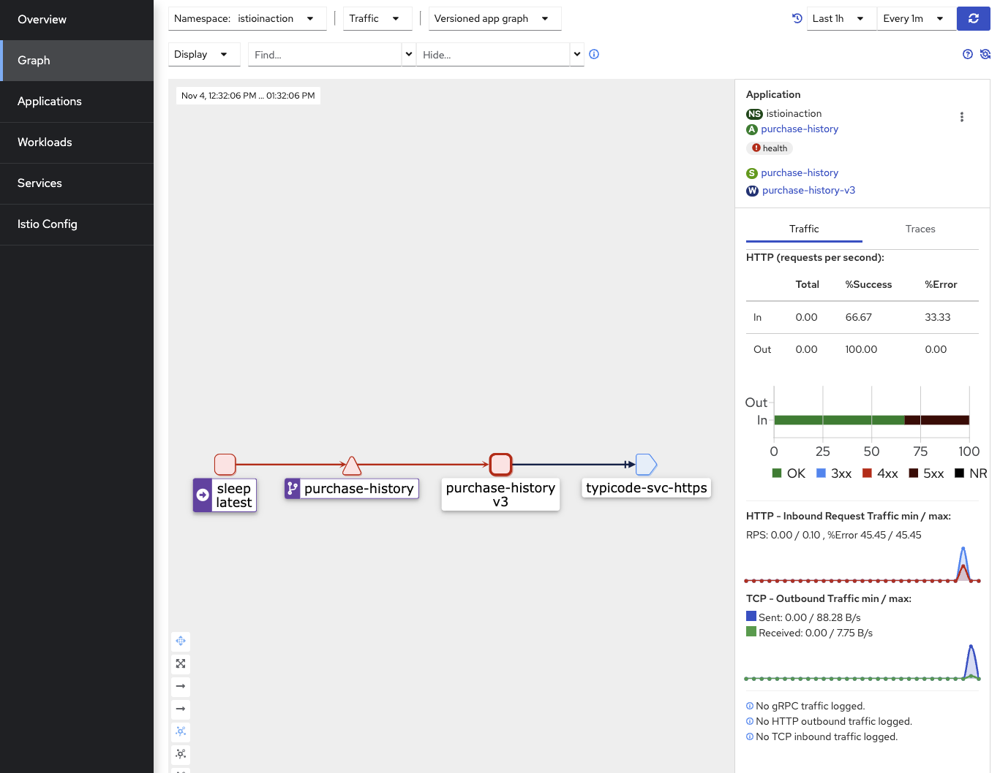

# Resiliency and Chaos Testing
You will explore some features provided by Istio to increase the resiliency between the services. When you build a distributed application, it is critical to ensure the services in your application are resilient to failures in the underlying platforms or the dependent services. Istio has support for retries, timeouts, circuit breakers, and even injecting faults into your service calls to help you test and tune your timeouts. Similar to the dark launch and canary testing you explored earlier, you don't need to add these logic rules into your application code or redeploy your application when configuring these Istio features to increase the resiliency of your services.

## Retries
1. Istio supports program retries for your services in the mesh without you specifying any changes to your code. By default, client requests to each of your services in the mesh will be retried twice. What if you want a different number of retries per route for some of your virtual services? You can adjust the number of retries or disable them altogether when automatic retries don't make sense for your services. Display the content of the `purchase-history-vs-all-v2-v3-retries.yaml`:

    ```
    cat labs/05/purchase-history-vs-all-v2-v3-retries.yaml
    ```

    Note the number of retries configuration is for the `purchase-history` service when the http header user matches exactly to Tom then routes to v3 of the `purchase-history` service. All other cases, it continues to route to `v2` of the `purchase-history` service.

2. Apply the virtual service resource to the istioinaction namespace, along with the updated `purchase-history` destination rule that contains the `v3` subset:

    ```
    kubectl apply -f labs/05/purchase-history-vs-all-v2-v3-retries.yaml -n istioinaction
    kubectl apply -f labs/05/purchase-history-dr-v3.yaml -n istioinaction
    ```
3. To see the new retry configuration in action, you can create a new version of the `purchase history (v3)` which errors `50%` of the time with `503` error code and `4 seconds` of `error delay`. You will use it to simulate a bad application deployment and show how retries would help prevent end users from experiencing them.

    ```
    cat labs/05/purchase-history-v3.yaml
    ```
    ```
    - name: "ERROR_CODE"
        value: "503"
    - name: "ERROR_RATE"
        value: "0.5"
    - name: "ERROR_TYPE"
        value: "delay"
    - name: "ERROR_DELAY"
        value: "4s"
    ```

4. Deploy the new version of the purchase history (`v3`) to the `istioinaction` namespace:

    ```
    kubectl apply -f labs/05/purchase-history-v3.yaml -n istioinaction
    ```

5. Generate some load with the `user: Tom` header to ensure traffic goes `100%` to `v3` of the `purchase-history` service. You will quickly see errors from the `v3` of the `purchase-history` service:

    ```
    for i in {1..6}; 
    do kubectl exec deploy/sleep -n istioinaction -- curl -s -H "user: Tom" http://purchase-history:8080/; 
    done
    ```
    You will see `50%` successful rate and `50%` failure with `503` error code. If you remove the retries configuration (see `labs/05/purchase-history-vs-all-v2-header-v3.yaml`) and use Istio's default retry, you should not see any errors from `v3` of the `purchase-history` service because the service errors `50%` of the time and Istio will retry any failed request to the service with `503` error code automatically up to two times:

6. Lets add back the automatic retries by removing the `retries.attempts: 0` in the `VirtualService`

    ```
    cat labs/05/purchase-history-vs-all-v2-header-v3.yaml
    kubectl apply -f labs/05/purchase-history-vs-all-v2-header-v3.yaml -n istioinaction
    ```
7. Generate some load you should NOT see any errors from the `v3` of the `purchase-history` service:

    ```
    for i in {1..6}; 
    do kubectl exec deploy/sleep -n istioinaction -- curl -s -H "user: Tom" http://purchase-history:8080/; 
    done
    ```

8. If you check the logs of the `purchase-history` service, you will see the retries:

    ```
    kubectl logs deploy/purchase-history-v3 -n istioinaction | grep x-envoy-attempt-count
    ```
    In the log shown below, the first request was not successful but the automatic retry was successful:

    ```
    x-envoy-attempt-count: 1
    x-envoy-attempt-count: 2
    x-envoy-attempt-count: 1
    x-envoy-attempt-count: 2
    ```
Note: The error code has to be `503` for Istio to retry the requests. If you change the `ERROR_CODE` to `500` in the `purchase-history-v3.yaml`, redeploy the updated `purchase-history-v3.yaml` file and send some request to the `purchase-history` service from the `sleep` pod, you will get errors `50%` of the time.

## Traffic Monitoring
Lets take a look at the traffic in the `Kiali UI`

1. Navigate to the `Graph` Tab and select the `istioinaction` namespace.

2. Change the time to `Last 1h` and click on the `purchase-history-v3` service. On the right hand side you should be able to observe the errors and response times.



## Timeouts
1. Istio has built-in support for timeouts with client requests to services within the mesh. The default timeout for HTTP request in Istio is disabled, which means there is no timeout. You can overwrite the default timeout setting of a service route within the route rule for a virtual service resource. For example, in the route rule within the `purchase-history-vs` resource below, you can add the following timeout configuration to set the timeout of the route to the `purchase-history` service on port `8080`, along with `3 retry attempts` with each retry timing out after `3 seconds`.

    ```
    cat labs/05/purchase-history-vs-all-v2-v3-retries-timeout.yaml
    ```

2. Apply the resource in the `istioinaction` namespace:

    ```
    kubectl apply -f labs/05/purchase-history-vs-all-v2-v3-retries-timeout.yaml -n istioinaction
    ```

3. Send some traffic to the purchase-history service from the sleep pod:

    ```
    for i in {1..6}; 
    do kubectl exec deploy/sleep -n istioinaction -- curl -s -H "user: Tom" http://purchase-history:8080/|grep timeout; 
    done
    ```
    You will see three requests time out:

    ```
    upstream request timeout
    upstream request timeout
    upstream request timeout
    ```
    With the addition of `3 retries`, and a `50% failure rate`, why is it returning `"upstream request timeout"` errors? Shouldn't it have retried after a failure with the subsequent attempt succeeding? It didn't retry because retries will be done for only specific retry conditions that you can configure.

    The default `retryOn` conditions don't include a response taking too long, which is what happened with the `3` second `preTryTimeout` and the delay from `purchase-history-v3` taking `4` seconds. You can view the conditions that can be configured with `retryOn`.

4. Let's add `retryOn` conditions to include `5xx` which will result in retry attempts being done for a delayed response (`readTimeout`).

    Display the contents of purchase-history-vs-all-v2-v3-retries-timeout-retryon.yaml with the addition of the retryOn line:

    ```
    cat labs/05/purchase-history-vs-all-v2-v3-retries-timeout-retryon.yaml
    ```

    Apply the resource:

    ```
    kubectl apply -f labs/05/purchase-history-vs-all-v2-v3-retries-timeout-retryon.yaml -n istioinaction
    ```
    Now when you generate load with `user: Tom`, there will be a delay, but no more upstream request timeout errors due to the retries now being done for delayed responses:

    ```
    for i in {1..6}; 
    do kubectl exec deploy/sleep -n istioinaction -- curl -s -H "user: Tom" http://purchase-history:8080/|grep timeout; 
    done
    ```

# Circuit Breakers

Circuit breaking is an important pattern for creating resilient microservice applications. Circuit breaking allows you to limit the impact of failures and network delays, which are often outside of your control when making requests to dependent services. Prior to having your service mesh, you had to add logic directly within your code (or your language specific library) to handle situations when the calling service fails to provide the desirable result. Istio allows you to apply circuit breaking configurations within a destination rule resource, eliminating the need to modify your service code.

1. Take a look at the updated `purchase-history-dr` destination rule as shown in the example that follows. It defines the connection pool configuration to indicate the maximum number of TCP connections, show the maximum number of HTTP requests per connection, and set the `outlier detection` to be `three minutes` after an error. When any clients access the `purchase-history-dr` service, these circuit-breaker behavior rules will be followed.

    ```
    cat labs/05/purchase-history-dr-v3-cb.yaml
    ```

2. Apply the resource in the `istioinaction` namespace:

    ```
    kubectl apply -f labs/05/purchase-history-dr-v3-cb.yaml -n istioinaction
    ```

3. Make requests against the `purchase-history` application with outlier detection enabled.

    ```
    for i in {1..50}; do kubectl exec deploy/sleep -n istioinaction -- curl -s -H "user: Tom" http://purchase-history:8080/; 
    done
    ```

    You may have noticed but our current outlier detection configuration tells Istio to remove the `purchase-history` backend if it returns any 5xx error. It then will not allow routing to it until 5s has elapsed.

    ```
    outlierDetection:
      consecutive5xxErrors: 1
      interval: 1s
      baseEjectionTime: 5s
      maxEjectionPercent: 100
    ```

## Fault Injection
It can be difficult to configure service timeouts and circuit-breakers properly in a distributed microservice application. Istio makes it easier to get these settings correct by enabling you to inject faults into your application without the need to modify your code. With Istio, you can perform chaos testing of your application easily by adding an HTTP delay fault into the `web-api` service only for user Amy so that the injected fault doesn't affect any other users.

1. You can inject a `30-second` fault delay for `100%` of the client requests when the `user` HTTP header value exactly matches the value `Amy`.

    ```
    cat labs/05/web-api-gw-vs-fault-injection.yaml
    ```

2. Apply the virtual service resource using the following command:

    ```
    kubectl apply -f labs/05/web-api-gw-vs-fault-injection.yaml -n istioinaction
    ```

3. Send some traffic to the `web-api` service, you should see `200` response code right away:

    ```
    curl --cacert ./labs/02/certs/ca/root-ca.crt -H "Host: istioinaction.io" https://istioinaction.io:$SECURE_INGRESS_PORT --resolve istioinaction.io:$SECURE_INGRESS_PORT:$GATEWAY_IP
    ```
4. Send some traffic to the `web-api` service with the `user: Amy` header, you should see a `200` response code after a `15` seconds delay:

    ```
    curl --cacert ./labs/02/certs/ca/root-ca.crt -H "Host: istioinaction.io" -H "user: Amy" https://istioinaction.io:$SECURE_INGRESS_PORT --resolve istioinaction.io:$SECURE_INGRESS_PORT:$GATEWAY_IP
    ```
    Note that there is no change to the `web-api` service to inject the delay. Istio injects the delay automatically via programmatically configuring the `istio-proxy` container.