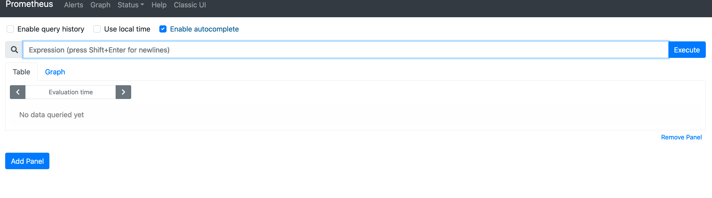
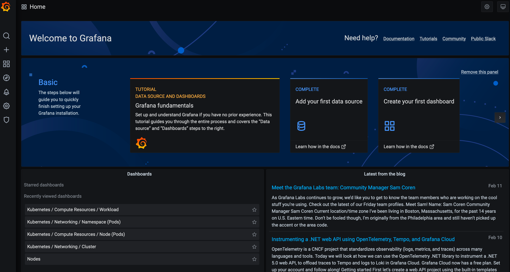
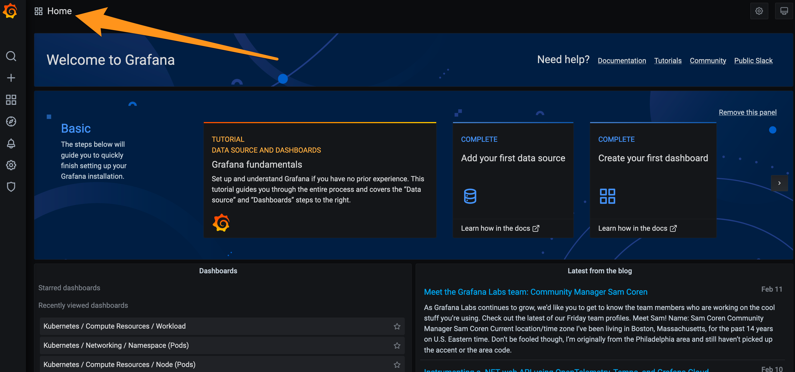
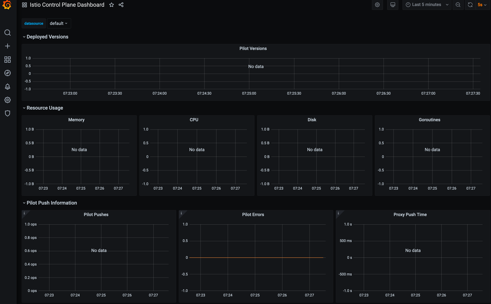
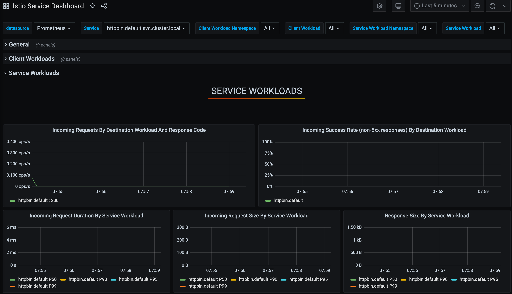
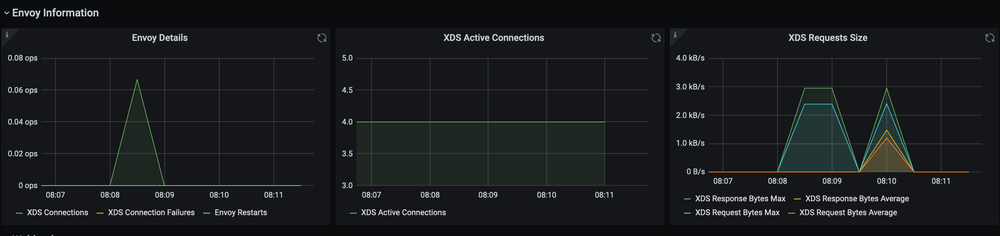
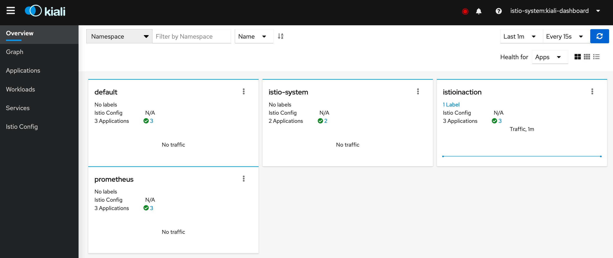

# Deploy Istio to production
## Lab 01 - Running Envoy
In this lab we will dig into one of the foundational pieces of Istio, the `"data plane"` or service proxy. These live with each service/application instance on the request path on both origination of a service call as well as usually on the destination side of the service call.

The service proxy that Istio uses is `Envoy` Proxy. `Envoy` is an incredibly powerful and well-suited proxy for this use case.

It's impossible to overstate how important `Envoy` is to Istio, which is why we start the labs with it.

### Set up supporting services
Disable `istio-ịnection` if available
```
kubectl label ns default istio-injection-
```

We use a simple `httpbin` service as well as `sleep` app to exercise the basic functionality of Envoy in this lab.

```
kubectl apply -f labs/01/httpbin.yaml
kubectl apply -f labs/01/sleep.yaml
```
To verify we have things installed correctly, let's try running it:

```
kubectl exec deploy/sleep -- curl -s httpbin:8000/headers
```
Note, it may take a few moments for the `sleep` pod to come up, so you may need to retry the previous command if it fails

```
{
  "headers": {
    "Accept": "*/*",
    "Host": "httpbin:8000",
    "User-Agent": "curl/7.69.1"
  }
}
```

### Review Envoy proxy config
Envoy can be configured completely by loading a YAML/JSON file or in part with a dynamic API. The dynamic API is a big reason why microservice networking frameworks like Istio use Envoy, but we start by first understanding the configuration from a basic level.

We will use the file configuration format. Take a look at a simple configuration file:

```sh
cat labs/01/envoy-conf.yaml
```
```yaml
admin:
  accessLogPath: /dev/stdout
  address:
    socketAddress:
      address: 0.0.0.0
      portValue: 15000
staticResources:
  listeners:
  - name: httpbin-listener
    address:
      socketAddress:
        address: 0.0.0.0
        portValue: 15001
    filterChains:
    - filters:
      - name: envoy.filters.network.http_connection_manager
        typedConfig:
          '@type': type.googleapis.com/envoy.extensions.filters.network.http_connection_manager.v3.HttpConnectionManager
          httpFilters:
          - name: envoy.filters.http.router
          routeConfig:
            name: simple_httpbin_route
            virtualHosts:
            - domains:
              - '*'
              name: httpbin_host
              routes:
              - match:
                  prefix: /
                route:
                  cluster: httpbin_service
          statPrefix: httpbin
  clusters:
  - connectTimeout: 5s
    loadAssignment:
      clusterName: httpbin_service
      endpoints:
      - lbEndpoints:
        - endpoint:
            address:
              socketAddress:
                address: httpbin
                portValue: 8000
    name: httpbin_service
    respectDnsTtl: true
    dnsLookupFamily: V4_ONLY
    type: STRICT_DNS
    upstreamConnectionOptions:
      tcpKeepalive: {}
```

In this configuration, we see three main sections:

- [Admin] - Setting up the administration API for the proxy
- [Listeners] - Declaration of ports to open on the proxy and listen for incoming connections
- [Clusters] - Backend service to which we can route traffic

Let's now deploy this configuration to Envoy and deploy our Envoy Proxy:

```
kubectl create cm envoy --from-file=envoy.yaml=./labs/01/envoy-conf.yaml -o yaml --dry-run=client | kubectl apply -f -
kubectl apply -f labs/01/envoy-proxy.yaml
```
Now let's try to call the `Envoy Proxy` and see that it correctly routes to the `httpbin` service:

```
kubectl exec deploy/sleep -- curl -s http://envoy/headers
```
Now our response from `httpbin` should look similar to this:

```
{
  "headers": {
    "Accept": "*/*",
    "Content-Length": "0",
    "Host": "envoy",
    "User-Agent": "curl/7.69.1",
    "X-Envoy-Expected-Rq-Timeout-Ms": "15000"
  }
}
```
We now see a response with some enriched response headers, `X-Envoy-Expected-Rq-Timeout-Ms`

### Change the call timeout
Now that we have Envoy on the request path of a service-to-service interaction, let's try changing the behavior of the call. With this default configuration, we saw an expected request timeout of 15s. Let's try to change the call timeout.

To change the call timeout, let's take a look at the routing configuration and add a parameter that specifies the timeout:

```yaml
routeConfig:
  name: simple_httpbin_route
  virtualHosts:
  - domains:
    - '*'
    name: httpbin_host
    routes:
    - match:
        prefix: /
      route:
        cluster: httpbin_service
        timeout: 1s
```
Here, we can see we set the timeout to 1s. Let's try to call the `httpbin` service again through the Envoy proxy. First, let's update the configuration:

```
kubectl create cm envoy --from-file=envoy.yaml=./labs/01/envoy-conf-timeout.yaml -o yaml --dry-run=client | kubectl apply -f -
```
We will also need to restart Envoy to pick up the new configuration:

```
kubectl rollout restart deploy/envoy
kubectl exec deploy/sleep -- curl -s http://envoy/headers
```
We should see the headers now look like this:

```
{
  "headers": {
    "Accept": "*/*",
    "Content-Length": "0",
    "Host": "envoy",
    "User-Agent": "curl/7.69.1",
    "X-Envoy-Expected-Rq-Timeout-Ms": "1000"
  }
}
```
If we call our service, which takes longer than 1s, we should see a HTTP 504 / gateway timeout:

```
kubectl exec deploy/sleep -- curl -vs http://envoy/delay/5
```

```
*   Trying 10.8.6.203:80...
* Connected to envoy (10.8.6.203) port 80 (#0)
> GET /delay/5 HTTP/1.1
> Host: envoy
> User-Agent: curl/7.69.1
> Accept: */*
> 
upstream request timeout* Mark bundle as not supporting multiuse
< HTTP/1.1 504 Gateway Timeout
< content-length: 24
< content-type: text/plain
< date: Sun, 05 Nov 2023 03:25:31 GMT
< server: envoy
< 
{ [24 bytes data]
* Connection #0 to host envoy left intact
```

Although this is pretty simple so far, we can see how Envoy can become very valuable for a service-to-service request path. Enriching the networking with timeouts, retries, circuit breaking, etc. allow the service to focus on business logic and differentiating features vs. boring cross-cutting networking features.

### Admin stats
Now that we have a basic understanding of how to configure Envoy, let's take a look at another very important feature of Envoy proxy: `stats` and `telemetry` signals. One of the main reasons Envoy was even built was to give more visibility into what's happening on the network at the L7/request level. Let's take a look at how to get some of those stats.

Envoy exposes a /stats endpoint we can inspect:

```
kubectl exec deploy/sleep -- curl -s http://envoy:15000/stats
```
Wow, that's a lot of good info! Let's trim it down. Maybe we just want to see retry when the proxy calls the `httpbin` service:

```
kubectl exec deploy/sleep -- curl -s http://envoy:15000/stats | grep retry
```
```
cluster.httpbin_service.circuit_breakers.default.rq_retry_open: 0
cluster.httpbin_service.circuit_breakers.high.rq_retry_open: 0
cluster.httpbin_service.retry_or_shadow_abandoned: 0
cluster.httpbin_service.upstream_rq_retry: 0
cluster.httpbin_service.upstream_rq_retry_backoff_exponential: 0
cluster.httpbin_service.upstream_rq_retry_backoff_ratelimited: 0
cluster.httpbin_service.upstream_rq_retry_limit_exceeded: 0
cluster.httpbin_service.upstream_rq_retry_overflow: 0
cluster.httpbin_service.upstream_rq_retry_success: 0
vhost.httpbin_host.vcluster.other.upstream_rq_retry: 0
vhost.httpbin_host.vcluster.other.upstream_rq_retry_limit_exceeded: 0
vhost.httpbin_host.vcluster.other.upstream_rq_retry_overflow: 0
vhost.httpbin_host.vcluster.other.upstream_rq_retry_success: 0
```

Nice! Things have been running smoothly so far. No request retries. Let's change that.

### Retrying failed requests
Calling services over the network can get scary. Services don't always respond or may fail for some network reasons. We can have Envoy automatically retry when a request fails. Now, this isn't appropriate for every request, but Envoy can be tuned to be smarter about when to retry.

Let's see how to configure to retry on HTTP 5xx requests:

```
cat labs/01/envoy-conf-retry.yaml
```
```yaml
routeConfig:
  name: simple_httpbin_route
  virtualHosts:
  - domains:
    - '*'
    name: httpbin_host
    routes:
    - match:
        prefix: /
      route:
        cluster: httpbin_service
        timeout: 1s
        retryPolicy:
          retryOn: 5xx
          numRetries: 3
```

Note the configuration for retries on `5xx`.

Let's apply this new configuration:

```
kubectl create cm envoy --from-file=envoy.yaml=./labs/01/envoy-conf-retry.yaml -o yaml --dry-run=client | kubectl apply -f -
kubectl rollout restart deploy/envoy
```
Now let's try to call an `httpbin` service endpoint that deliberately returns an error code:

```
kubectl exec deploy/sleep -- curl -vs http://envoy/status/500
```
We see the call fails:
```
*   Trying 10.8.6.203:80...
* Connected to envoy (10.8.6.203) port 80 (#0)
> GET /status/500 HTTP/1.1
> Host: envoy
> User-Agent: curl/7.69.1
> Accept: */*
> 
* Mark bundle as not supporting multiuse
< HTTP/1.1 500 Internal Server Error
< server: envoy
< date: Sun, 05 Nov 2023 03:32:09 GMT
< content-type: text/html; charset=utf-8
< access-control-allow-origin: *
< access-control-allow-credentials: true
< content-length: 0
< x-envoy-upstream-service-time: 111
< 
* Connection #0 to host envoy left intact
```

So let's see what Envoy observed in terms of retries:

```
kubectl exec deploy/sleep -- curl http://envoy:15000/stats | grep retry
```

```
cluster.httpbin_service.circuit_breakers.default.rq_retry_open: 0
cluster.httpbin_service.circuit_breakers.high.rq_retry_open: 0
cluster.httpbin_service.retry.upstream_rq_500: 3
cluster.httpbin_service.retry.upstream_rq_5xx: 3
cluster.httpbin_service.retry.upstream_rq_completed: 3
cluster.httpbin_service.retry_or_shadow_abandoned: 0
cluster.httpbin_service.upstream_rq_retry: 3
cluster.httpbin_service.upstream_rq_retry_backoff_exponential: 3
cluster.httpbin_service.upstream_rq_retry_backoff_ratelimited: 0
cluster.httpbin_service.upstream_rq_retry_limit_exceeded: 1
cluster.httpbin_service.upstream_rq_retry_overflow: 0
cluster.httpbin_service.upstream_rq_retry_success: 0
vhost.httpbin_host.vcluster.other.upstream_rq_retry: 0
vhost.httpbin_host.vcluster.other.upstream_rq_retry_limit_exceeded: 0
vhost.httpbin_host.vcluster.other.upstream_rq_retry_overflow: 0
vhost.httpbin_host.vcluster.other.upstream_rq_retry_success: 0
```
We see that indeed the call to httpbin did get retried 3 times.

### Recap
So far we have taken a basic approach to understanding what the Envoy proxy is and how to configure it. We have also seen how it can alter the behavior of a network call and give us valuable information about how the network is behaving at the request/message level.

## Lab 02 - Installing Istio
In the previous lab we saw how Envoy works. We also saw that Envoy needs a control plane to configure it in a dynamic environment like a cloud platform built on containers or Kubernetes.

Istio provides that control plane to drive the behavior of the network. Istio provides mechanisms for getting the Envoy proxy (also known as Istio service proxy, sidecar proxy, or data plane) integrated with workloads deployed to a system and for them to automatically connect to the control plane securely. Users can then use the control plane's API to drive the behavior of the network. Let's start installing and configuring Istio in this lab.

### Prerequisites
This lab will start by deploying some services in Kubernetes. The scenario we are replicating is one where Istio is being added to a set of workloads and that existing services are deployed into the cluster. In this lab (Lab 02) we will focus on getting Istio installed and in a later lab show how to iteratively roll out the mesh functionality to the workloads.

Make sure to clean up the existing Istio installation if available
```
helm delete istio-ingressgateway -n istio-system
helm delete istiod -n istio-system
helm delete istio-base -n istio-system
```

### Deploy the sample application
Let's set up the `sample-apps`:

```
kubectl create ns istioinaction
```
Now let's create some services:

```
kubectl apply -n istioinaction -f sample-apps/web-api.yaml
kubectl apply -n istioinaction -f sample-apps/recommendation.yaml
kubectl apply -n istioinaction -f sample-apps/purchase-history-v1.yaml
kubectl apply -n istioinaction -f sample-apps/sleep.yaml
```
After running these commands, we should check the pods running in the `istioinaction` namespace:

```
kubectl get po -n istioinaction
```
```
NAME                                  READY   STATUS    RESTARTS   AGE
purchase-history-v1-8c7fdcd9d-whn9h   1/1     Running   0          21s
recommendation-6d5786d695-tg9dz       1/1     Running   0          24s
sleep-7d9ff98856-pbcsg                1/1     Running   0          17s
web-api-7964d5d569-sgkfs              1/1     Running   0          27s
```
You now have some existing workloads in your cluster. Let's proceed to install the Istio control plane.

### Istio CLI installation
Download Istio 1.17.6

```
export ISTIO_VERSION=1.17.6
export ISTIO_REVISION=1-17
curl -L https://istio.io/downloadIstio | ISTIO_VERSION=${ISTIO_VERSION} sh -
```

Add the istioctl client to the PATH:
```
export PATH=$PWD/istio-${ISTIO_VERSION}/bin:$PATH
```

Check istioctl version:
```
istioctl version
```
We don't have the Istio control plane installed and running yet. Let's go ahead and do that. There are three ways to install Istio:

- istioctl CLI tool
- Istio Operator
- Helm

We will use the `istioctl` approach to install Istio following some best practices to set you up for future success.

Helm 3 is another common approach to installing and upgrading Istio. 

### Installing Istio
Before we install Istio we will create a namespace where we will deploy Istio and create a Kubernetes service to represent the Istio control plane. Creating this service is needed to workaround a long-standing issue with Istio revisions until the Istio "tags" functionality makes it into the project.

Start with creating the namespace:

```
kubectl create ns istio-system
```
Next let's create the control plane service `istiod`:

```
kubectl apply -f labs/02/istiod-service.yaml
```
Lastly, we will install the Istio control plane using the profile.

Our installation is `"minimal"` here as we will only be installing the `istiod` part of the control plane.

```
istioctl install -y -n istio-system -f labs/02/control-plane.yaml --revision ${ISTIO_REVISION}
```
You should see output similar to this:
```
✔ Istio core installed
✔ Istiod installed
✔ Installation complete
```
We now have Istio installed! This `istiod` component includes various functionality like:

- xDS server for Envoy config
- Certificate Authority for signing workload certs
- Service discovery
- Sidecar injection webhook

If we check the `istio-system` workspace, we should see the control plane running:

```
kubectl get pod -n istio-system
NAME                           READY   STATUS    RESTARTS   AGE
istiod-1-17-848ddb5896-bq56k   1/1     Running   0          99s
```
From here, we can query the Istio control plane's debug endpoints to see what services we have running and what Istio has discovered.

```
kubectl exec -n istio-system deploy/istiod-${ISTIO_REVISION} -- pilot-discovery request GET /debug/registryz | jq
```
The output of this command can be quite verbose as it lists all of the services in the Istio registry. Workloads are included in the Istio registry even if they are not officially part of the mesh (ie, have a sidecar deployed next to it).

### Install sidecar for demo app
In this section we'll install a sidecar onto the `httpbin` service from the previous lab and explore it.

Run the following command to add the Istio sidecar to the `httpbin` service in the `default` namespasce:

```
kubectl label namespace default istio.io/rev=${ISTIO_REVISION}
kubectl apply -f labs/01/httpbin.yaml
kubectl rollout restart deployment httpbin
```
In the above command we configure `istioctl` to use the configmaps for our revision. We can run multiple versions of Istio concurrently and can specify exactly which revision gets applied in the tooling.

### Recap
At this point we have installed the Istio control plane following a slightly different method than the official docs, but one that sets us up for success for operating Istio.

## Lab 03 - Connecting To Observability Systems

One of the most powerful parts of Istio is its ability to use the mesh to quickly troubleshoot and diagnose issues that inevitably come up in microservices networking. Where are requests slowing down? Where are they failing? Where are things becoming overloaded? Having something like Envoy proxy in the request path on both sides of a transport between services acts like a flood light to help uncover these issues.


We saw in Lab 01 that Envoy surfaces a large set of `stats`, `metrics`, `gauges`, and `histograms`. In this lab we look at connecting that source of information to an observability system. In many ways the mesh makes these systems more valuable. Istio comes with a few sample addons for adding observability components like `Prometheus`, `Grafana`, `Kiali`, `Jaeger` and `Zipkin`. In this lab we assume you are not going to use these components in production. They are intended for very simple deployments and not intended for a realistic production setup. We will install something that looks more realistic and use that. It is important to note that Istio's sample addons for Prometheus, Grafana, Kiali, etc are NOT intended for production usage. This guide will walk through a more production-like setup.

### Prerequisites
We will be using a realistic observability system that uses `Prometheus` and many other components out of the box called `kube-prometheus`. This project tries to curate and pre-integrate a realistic deployment, highly available deployment of Prometheus with the Prometheus operator, Grafana, and a lot of ancillary pieces like `alertmanager`, `node-exporters`, adap`ters for the Kube API, and others. Please see the `kube-prometheu`s docs for more.

Adding services to the mesh requires that the client-side proxies be associated with the service components and registered with the control plane. With Istio, you have two methods to inject the Envoy Proxy sidecar into the microservice Kubernetes pods

### Install kube-prometheus and highly-available Prometheus
To get started, let's create the namespace into which we'll deploy our observability components:

```
export PROMETHEUS_HELM_VERSION=42.2.1
kubectl create ns prometheus
```
Next, let's add the prometheus community chart repo and then update available helm charts locally.

```
helm repo add prometheus-community https://prometheus-community.github.io/helm-charts
helm repo update
```
Next, let's run the helm installer.

```
helm install prom prometheus-community/kube-prometheus-stack \
  --set grafana.defaultDashboardsEnabled=false \
  --set 'grafana.grafana\.ini.auth\.anonymous.enabled'=true \
  --version ${PROMETHEUS_HELM_VERSION} \
  -n prometheus
```
This command may take a few moments to complete; be patient.

At this point, we should have a successfully installed prometheus. To verify the components that were installed to support observability for us, let's check the pods:

```
kubectl get po -n prometheus
NAME                                                     READY   STATUS    RESTARTS      AGE
alertmanager-prom-kube-prometheus-stack-alertmanager-0   2/2     Running   1 (35s ago)   39s
prom-grafana-797868cb-zhp6z                              3/3     Running   0             45s
prom-kube-prometheus-stack-operator-98f7dbf9f-bh7jd      1/1     Running   0             46s
prom-kube-state-metrics-69c5b44698-sbsd2                 1/1     Running   0             45s
prom-prometheus-node-exporter-n7ftm                      1/1     Running   0             46s
prom-prometheus-node-exporter-r5nk7                      1/1     Running   0             46s
prom-prometheus-node-exporter-rvhrg                      1/1     Running   0             46s
prometheus-prom-kube-prometheus-stack-prometheus-0       2/2     Running   0             38s
```

Now move over to terminal 2. Let's quickly `port-forward` the Prometheus deployment and verify we can connect to it:

```
kubectl -n prometheus port-forward statefulset/prometheus-prom-kube-prometheus-stack-prometheus 9090 --address 0.0.0.0
```
Now verify it works by openning the Prometheus dashboard 
```
open http://localhost:9090
```


Press `ctrl+C` on terminal 2 to end the port forwarding and let's try the same thing for the Grafana dashboard:

```
kubectl -n prometheus port-forward svc/prom-grafana 3000:80 --address 0.0.0.0
```

Go to the Grafana

```
open http://localhost:3000
```

Now you should see the main dashboard like this:



Feel free to poke around and see what dashboards are available with this default set up. Note that if you're unfamiliar with Grafana, you should start by clicking the "Home" button on the top left of the main screen

Press `crtl+C` on terminal 2 when you are done

### Add Istio Dashboards to Grafana
There are out of the box Grafana dashboards that Istio includes with its sample version of the Grafana installation. As mentioned earlier in the lab, this is intended for demonstration purposes only and not for production.

As we've installed Grafana in a more realistic scenario, we should figure out how to get the Istio Grafana dashboards into our deployment of Grafana. The first step is to get the dashboards from the Istio source repo located here https://grafana.com/orgs/istio.

To get them to work with our-installed Grafana, we need to import them as configmaps. Run the following, kinda-long, command to do this in either terminal:

```
kubectl -n prometheus create cm istio-dashboards \
--from-file=istio-control-plane-dashboard.json=labs/03/dashboards/istio-control-plane-dashboard.json \
--from-file=istio-workload-dashboard.json=labs/03/dashboards/istio-workload-dashboard.json \
--from-file=istio-service-dashboard.json=labs/03/dashboards/istio-service-dashboard.json \
--from-file=istio-mesh-dashboard.json=labs/03/dashboards/istio-mesh-dashboard.json \
--from-file=istio-performance-dashboard.json=labs/03/dashboards/istio-performance-dashboard.json
```
Lastly, we need to label this configmap so that our Grafana picks it up:

```
kubectl label -n prometheus cm istio-dashboards grafana_dashboard=1
```

Access to Grafana UI and on the main screen click the "Home" link on the top left part of the dashboard:


From here, you should see the new Istio dashboards that have been added under 'General', but note that it may take a few moments for the dashboards to appear.


Click the "Istio Control Plane" dashboard. You should be taken to a dashboard with some interesting graphs.



Actually, the graphs are almost empty!! This is not of much value to us, so let's figure out how to populate these graphs. It may take quite a few minutes for data to populate into the Grafana dashboards. In practice, it may be worth moving on to other parts and coming back later to check the data in the dashboards.

### Scraping the Istio service mesh: control plane
The reason we don't see any information in the Control Plane dashboard (or any of the Istio dashboards really) is because we don't have any configuration for scraping information from the Istio service mesh. To configure Prometheus to do this, we will use the Prometheus Operator CRs `ServiceMonitor` and `PodMonitor`. These Custom Resources are described in good detail in the design doc on the Prometheus Operator repo.

You can leave the port fowarding on in terminal 2 but move over to terminal 1. Here's how we can set up a `ServiceMonitor` to scrape the Istio control-plane components:

```yaml
# labs/03/monitor-control-plane.yaml
apiVersion: monitoring.coreos.com/v1
kind: ServiceMonitor
metadata:
  name: istio-component-monitor
  namespace: prometheus
  labels:
    monitoring: istio-components
    release: prom
spec:
  jobLabel: istio
  targetLabels: [app]
  selector:
    matchExpressions:
    - {key: istio, operator: In, values: [pilot]}
  namespaceSelector:
    any: true
  endpoints:
  - port: http-monitoring
    interval: 15s
```

Let's apply it:

```
kubectl apply -f labs/03/monitor-control-plane.yaml
```

At this point we will start to see important telemetry signals about the control plane such as the number of sidecars attached to the control plane, whether there are configuration conflicts, the amount of churn in the mesh, as well as basic memory/CPU usage of the control plane. As mentioned earlier, it may take a few minutes for these signals to start to make it into the Grafana dashboards, so be patient. Since there aren't very many workloads (just our `httpbin` service we installed for testing), we won't see too much data.

### Scraping the Istio service mesh: data plane
If we go check a different dashboard like "Istio Service Dashboard", we will see it's empty as there aren't any rules set up to scrape the data plane yet.

Just like we did in the previous section, we need to enable scraping for the data plane. To do that, we'll use a PodMonitor that looks like this:

```yaml
# labs/03/monitor-data-plane.yaml
apiVersion: monitoring.coreos.com/v1
kind: PodMonitor
metadata:
  name: envoy-stats-monitor
  namespace: prometheus
  labels:
    monitoring: istio-proxies
    release: prom
spec:
  selector:
    matchExpressions:
    - {key: istio-prometheus-ignore, operator: DoesNotExist}
  namespaceSelector:
    any: true
  jobLabel: envoy-stats
  podMetricsEndpoints:
  - path: /stats/prometheus
    interval: 15s
    relabelings:
    - action: keep
      sourceLabels: [__meta_kubernetes_pod_container_name]
      regex: "istio-proxy"
    - action: keep
      sourceLabels: [__meta_kubernetes_pod_annotationpresent_prometheus_io_scrape]
    - sourceLabels: [__address__, __meta_kubernetes_pod_annotation_prometheus_io_port]
      action: replace
      regex: ([^:]+)(?::\d+)?;(\d+)
      replacement: $1:$2
      targetLabel: __address__
    - action: labeldrop
      regex: "__meta_kubernetes_pod_label_(.+)"
    - sourceLabels: [__meta_kubernetes_namespace]
      action: replace
      targetLabel: namespace
    - sourceLabels: [__meta_kubernetes_pod_name]
      action: replace
      targetLabel: pod_name
```

Let's create it:

```
kubectl apply -f labs/03/monitor-data-plane.yaml
```
Let's also generate some load to the data plane (by calling our `httpbin` service) so telemetry will show up:

```
for i in {1..10}; do 
kubectl exec deploy/sleep -n default -- curl http://httpbin.default:8000/headers; 
done
```
Now we should be scraping the data-plane workloads. If we check Grafana under the Istio Service Dashboard, specifically the "Service Workload" section, we should start to see load after a bit of time.



If we go back and look at the Control Plane dashboard, we should see those XDS graphs now populated:



Press `ctl+C` on terminal 2 and then go back to terminal 1 for the next section

NOTE: If you do not see any metrics, wait a few min and check again. Prometheus is sometimes slow to capure data.

### Installing Kiali
Kiali is a networking graph dashboard that shows connectivity paths between services. This is different than a Grafana graph that shows line charts, bar graphs, etc. Kiali gives a visual representation of the services and how the connect to each other.

Again, Istio ships with a sample version of Kiali out of the box but for realistic deployments, the Istio and Kiali teams recommend using the Kiali Operator.

Let's install the kiali-operator here:

```
export KIALI_HELM_VERSION=1.59
kubectl create ns kiali-operator
helm install \
--set cr.create=true \
--set cr.namespace=istio-system \
--namespace kiali-operator \
--repo https://kiali.org/helm-charts \
--version ${KIALI_HELM_VERSION} \
kiali-operator \
kiali-operator
```

You may see helm complain about some parts of the Kiali install; you can ignore those for now and verify the Kiali Operator got installed correctly

At this point we have the Kiali operator installed. Let's check that it's up and running:

```
kubectl get po -n kiali-operator
NAME                              READY   STATUS    RESTARTS   AGE
kiali-operator-67f4977465-rq2b8   1/1     Running   0          42s
```
Now that the operator is installed, we need to declare an instance of Kiali to install and run. We will do that with the Kiali CR:

```yaml
# labs/03/kiali-no-auth.yaml
apiVersion: kiali.io/v1alpha1
kind: Kiali
metadata:
  namespace: istio-system
  name: kiali
spec:
  istio_namespace: "istio-system"
  istio_component_namespaces:
    prometheus: prometheus
  auth:
    strategy: anonymous
  deployment:
    accessible_namespaces:
    - '**'
  external_services:
    prometheus:
      cache_duration: 10
      cache_enabled: true
      cache_expiration: 300
      url: "http://prom-kube-prometheus-stack-prometheus.prometheus:9090"
    istio:
      config_map_name: istio-${ISTIO_REVISION}
      istiod_deployment_name: istiod-${ISTIO_REVISION}
      istio_sidecar_injector_config_map_name: istio-sidecar-injector-${ISTIO_REVISION}
```

Kiali leverages the telemetry signals that Prometheus scrapes from the Istio control plane and data plane. In the previous sections we installed Prometheus, but for Kiali, we need to configure it to use our specific Prometheus. In the configuration above you should see we configure Kiali to use Prometheus at `http://prom-kube-prometheus-stack-prometheus.prometheus:9090`. You may be wondering how to secure the connection between Kiali and Prometheus? Actually Prometheus doesn't come with any out of the box security strategies. They recommend running a reverse proxy (Envoy?!) in front of it. From Kiali we can use TLS and basic auth to connect to Prometheus.

Let's create the Kiali instance:

```
cat labs/03/kiali-no-auth.yaml | envsubst | kubectl apply -f -
```
Note, you may see kubectl complain about the manner in which we apply this resource; you can safely ignore it for this lab.

Let's check that it got created:

```
kubectl get po -n istio-system
NAME                            READY   STATUS    RESTARTS   AGE
istiod-1-14-78b88c997d-rpnck    1/1     Running   0          39h
kiali-67cd5cf9fc-lnwc9          1/1     Running   0          29s
```
Now back in terminal 2 let's port-forward the Kiali dashboard:

```
kubectl -n istio-system port-forward deploy/kiali 20001 --address 0.0.0.0
```


Congrats! You've installed the Kiali dashboard and connected it to the Prometheus instance collecting Istio telemetry. In the next few labs, we'll introduce our services to the mesh and send traffic through them. We should see Kiali populated with information at that point.

Recap
In this lab we've set up one of the most important parts of running a service mesh: the observability systems around it. At this point you should have a good understanding of the Istio data plane, have the control plane installed, and now have a realistic observability system.
