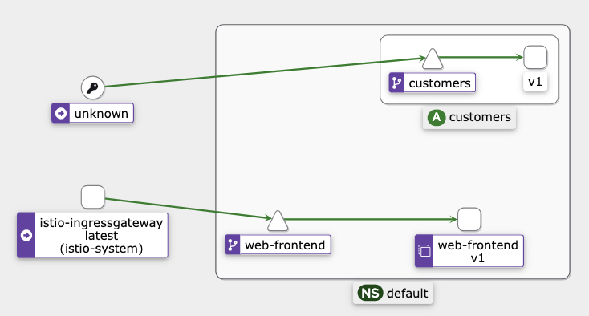
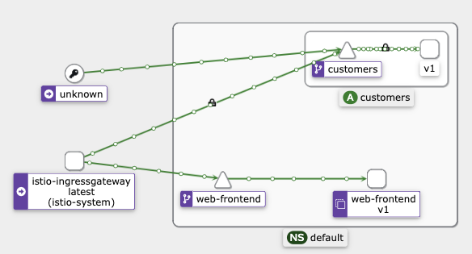

# Mutual TLS
In this lab, we will deploy the sample application (`web-frontend` and `customers` service). The` web-frontend` will be deployed without an Envoy proxy sidecar, while the `customers` service will have the sidecar injected. With this setup, we will see how Istio can send both `mTLS` and `plain text` traffic and change the `TLS mode` to `STRICT`.

1. Let's start by deploying a Gateway resource:

    ```yaml
    apiVersion: networking.istio.io/v1alpha3
    kind: Gateway
    metadata:
    name: gateway
    spec:
    selector:
        istio: ingressgateway
    servers:
        - port:
            number: 80
            name: http
            protocol: HTTP
        hosts:
            - '*'
    ```

2. Deploy the gateway
    ```
    kubectl apply -f gateway.yaml
    ```

3. Before deploying the applications, we will disable the automatic sidecar injection in the `default` namespace so the proxy doesn't get injected into the `web-frontend` deployment. Before we deploy the` customers-v1` service, we will enable the injection again so the workload gets the proxy injected.

    We are doing this to simulate a scenario where one workload is not part of the mesh.

    ```
    kubectl label namespace default istio-injection-
    ```
4. Create the `web-frontend` and related Kubernetes services.

    ```
    kubectl apply -f web-frontend.yaml
    ```

    If we look at the running Pods, we should see one Pod with a single container running, indicated by the 1/1 in the READY column:

    ```
    kubectl get po
    NAME                           READY   STATUS    RESTARTS   AGE
    web-frontend-6fbfcd568-9kj96   1/1     Running   0          86s
    ```
5. Let's re-enable the automatic sidecar proxy injection

    ```
    kubectl label namespace default istio-injection=enabled
    ```
6. And then deploy the `customers-v1` workload
    ```
    kubectl apply -f customers-v1.yaml
    ```
    We should have both applications deployed and running. The `customers-v1` pod will have two containers, and the `web-frontend` pod will have one.

    ```
    kubectl get po
    NAME                            READY   STATUS    RESTARTS   AGE
    customers-v1-6d79694546-875hf   2/2     Running   0          36s
    web-frontend-6fbfcd568-9kj96    1/1     Running   0          10m
    ```

## Permissive Mode in Action

Let’s set the environment variable called GATEWAY_IP that stores the gateway IP address

```
export GATEWAY_IP=$(kubectl get svc -n istio-system istio-ingressgateway -ojsonpath='{.status.loadBalancer.ingress[0].ip}')
```

If we try to navigate to the `GATEWAY_IP`, we will get the web page with the `customer` service's response.


Accessing the `GATEWAY_IP` works because of the `permissive` mode, where plain text traffic gets sent to the services that do not have the proxy. In this case, the ingress gateway sends plain text traffic to the `web-frontend` because there's no proxy.

## Observing the `Permissive` Mode in `Kiali`

If we open Kiali with `istioctl dash kiali` and look at the `Graph`, you will notice that Kiali detects calls made from the ingress gateway to the `web-frontend`. Make sure you select both the `default` namespace and the `istio-system` namespace and also `Last 10m`.



However, the calls made to the `customers` service are coming from unknown service. This is because there's no proxy next to the `web-frontend`. Therefore Istio doesn't know who, where or what that service is.

## Exposing the "customers" Service

1. Let's update the `customers` VirtualService and attach the gateway to it. Attaching the gateway allows us to make calls directly to the service.

    ```
    kubectl apply -f vs-customers-gateway.yaml
    ```
2. We can now specify the `Host` header and send the requests through the ingress gateway (`GATEWAY_IP`) to the `customers` service.

    ```
    curl -H "Host: customers.default.svc.cluster.local" http://$GATEWAY_IP
    ```
3. To generate some traffic to both the `web-frontend` and `customers-v1` deployments through the ingress, open the two terminal windows and run one command in each.

    ```sh
    # Terminal 1
    while true; do curl -H "Host: customers.default.svc.cluster.local" http://$GATEWAY_IP; done
    ```

    ```sh
    # Terminal 2
    while true; do curl ht‌tp://$GATEWAY_IP; done
    ```
4. Open `Kiali` and look at the `Graph`. From the `Display` dropdown, make sure you check the `Security` option. You should see a graph similar to the one in the following figure.

    


    Notice a padlock icon between the `istio-ingressgateway` and the `customers` service, which means the traffic gets sent using `mTLS`.

    However, there's no padlock between the `unknown` and the `customers-v1` service, as well as the `istio-ingress-gateway` and `web-frontend`. Proxies send plain text traffic between services that do not have the sidecar injected. 

5. Let's see what happens if we enable `mTLS` in `STRICT` mode. We expect the calls from the `web-frontend` to the `customers-v1` service to fail because there's no proxy injected to do the `mTLS` communication.

    On the other hand, the calls from the ingress gateway to the `customers-v1` service will continue working.

    ```
    kubectl apply -f strict-mtls.yaml
    ```
    If we still have the request loop running, we will see the `ECONNRESET` error message from the `web-frontend`. This error indicates that the `customers-v1` service closed the connection. In our case, it was because it was expecting an `mTLS` connection.

    On the other hand, the requests we make directly to the `customers-v1` service continue to work because the `customers-v1` service has an Envoy proxy running next to it and can do `mTLS`.

    If we delete the `PeerAuthentication` resource deployed earlier using `kubectl delete peerauthentication default`, Istio returns to its default, the `PERMISSIVE` mode, and the errors will disappear.

## Cleanup

To clean up the resources, run:

```
kubectl delete deploy web-frontend customers-v1
kubectl delete svc customers web-frontend
kubectl delete vs customers web-frontend
kubectl delete gateway gateway
```