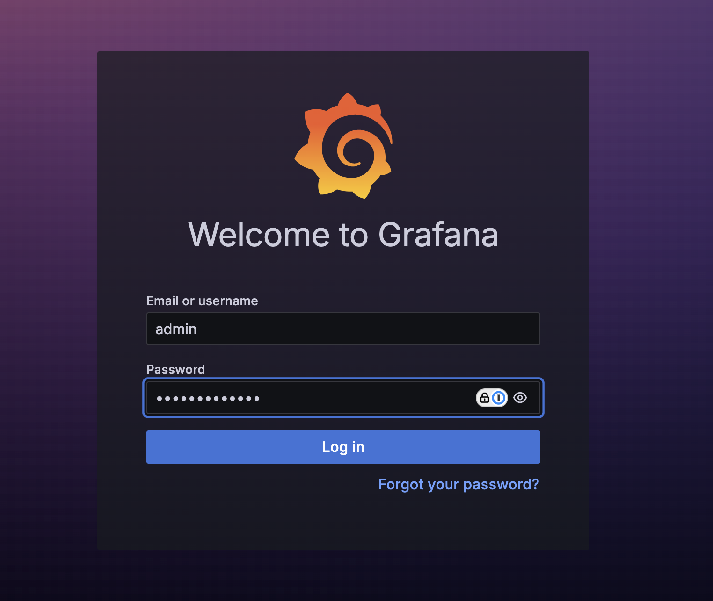

# Lab: Setup Prometheus & Grafana with kube-prometheus-stack in Kubernetes

This lab will guide you through the setup of Prometheus, Grafana, and associated exporters using the `kube-prometheus-stack` Helm chart. We’ll cover basic installation steps, and then explore Prometheus metrics using both Grafana and the Prometheus UI.

## Prerequisites
- A running Kubernetes cluster
- Helm installed on your local machine
- kubectl configured to access your cluster

## Step 0: Create a Minimal GKE Cluster

To avoid conflicts with `kube-prometheus-stack` and to keep costs low, we’ll create a small GKE cluster without logging or monitoring add-ons.

1. **Create a GKE Cluster Without Logging/Monitoring Add-Ons**

   Run the following `gcloud` command to create a small, zonal GKE cluster with autoscaling:

   ```sh
   gcloud container clusters create "lab-cluster" \
     --zone "asia-east1-a" \
     --num-nodes "2" \
     --enable-autoscaling \
     --min-nodes "2" \
     --max-nodes "3" \
     --machine-type "e2-medium" \
     --no-enable-managed-prometheus \
     --monitoring NONE \
     --logging NONE 
   ```

2. **Verify Cluster Access**

After the cluster is created, configure `kubectl` to access it:

```
gcloud container clusters get-credentials lab-cluster --zone asia-east1-a
```

## Step 1: Add and Update the Helm Repository

Add the `prometheus-community` Helm chart repository and update it.

```bash
helm repo add prometheus-community https://prometheus-community.github.io/helm-charts
helm repo update
```

## Step 2: Create a Namespace

We’ll install Prometheus and Grafana in a dedicated namespace called `monitoring`.

```bash
kubectl create namespace monitoring
```

## Step 3: Install kube-prometheus-stack

Install the `kube-prometheus-stack` Helm chart, which includes Prometheus, Grafana, and several exporters.

```bash
helm install prometheus prometheus-community/kube-prometheus-stack --namespace monitoring
```

This will deploy:
- Prometheus
- Grafana
- Node Exporter
- Kube State Metrics
- Alertmanager

## Step 4: Verify Installation

Check that all components are running by listing the pods in the `monitoring` namespace.

```bash
kubectl get pods -n monitoring
```

You should see pods for Prometheus, Grafana, and the exporters, all in a `Running` state.

## Step 5: Access Grafana

Grafana is installed as part of the stack and can be accessed via a `ClusterIP` service by default. You can port-forward to access it locally.

```bash
kubectl port-forward svc/prometheus-grafana -n monitoring 3000:80
```

Now, open your browser and navigate to `http://localhost:3000`. The default login credentials for Grafana are:

- Username: `admin`
- Password: `prom-operator`



> **Note**: It is recommended to change the default password after logging in.

## Step 6: Exploring Metrics with Grafana

1. **Add a Data Source**:
   - Grafana should already have Prometheus added as a default data source under `Data Sources`. You can check this by navigating to **Configuration > Data Sources**.
   
2. **Explore PromQL in Grafana**:
   - Go to **Explore** in Grafana (located in the left sidebar).
   - Select the **Prometheus** data source from the dropdown.
   - Enter a simple PromQL query to check metrics, for example:
     ```promql
     up
     ```
   - This will show the current status of all targets.

3. **Visualize a Metric**:
   - Go to **Dashboards > Manage** and explore the default dashboards installed with `kube-prometheus-stack`.
   - You can view Kubernetes cluster metrics, nodes, pods, and workload-level details.
   - Try viewing the **Kubernetes / Compute Resources / Namespace (Pods)** dashboard to observe CPU and memory metrics across namespaces.

## Step 7: Accessing Prometheus UI

Prometheus also comes with its own UI for querying and exploring metrics.

1. Port-forward to the Prometheus server to access it locally:

   ```bash
   kubectl port-forward svc/prometheus-kube-prometheus-prometheus -n monitoring 9090:9090
   ```

2. Open your browser and go to `http://localhost:9090`.

## Step 8: Run PromQL Queries in the Prometheus UI

1. In the Prometheus UI, go to the **Graph** tab.
2. Enter a PromQL query, for example:

   ```promql
   kube_pod_container_resource_requests_cpu_cores
   ```

   This query shows the CPU requests of each container running in the cluster.

3. Click **Execute** to see the data.

4. You can also use more complex queries. For example, to get the CPU usage for all containers:

   ```promql
   sum(rate(container_cpu_usage_seconds_total[5m])) by (pod)
   ```

   This query aggregates CPU usage across all containers over the last 5 minutes.

## Step 9: Additional Exercises

1. **Custom Grafana Dashboard**:
   - Try creating a new Grafana dashboard with custom panels showing specific metrics, such as `node_memory_MemFree_bytes` or `node_load1`.
   
2. **Alert Setup**:
   - You can set up alerts in Prometheus for various metrics, like high CPU usage, and view the alert statuses in Grafana’s **Alerting** section.

3. **Explore Node Exporter Metrics**:
   - Node Exporter provides hardware and OS metrics for each node in your cluster. In the Prometheus UI or Grafana Explore, run a query like:
     ```promql
     node_cpu_seconds_total
     ```
   - This displays detailed CPU usage for each node.

## Step 10: Clean Up

When you’re finished with the lab, you can uninstall the `kube-prometheus-stack` to clean up resources.

```bash
helm uninstall prometheus -n monitoring
kubectl delete namespace monitoring
```

CRDs created by this chart are not removed by default and should be manually cleaned up:

```sh
kubectl delete crd alertmanagerconfigs.monitoring.coreos.com
kubectl delete crd alertmanagers.monitoring.coreos.com
kubectl delete crd podmonitors.monitoring.coreos.com
kubectl delete crd probes.monitoring.coreos.com
kubectl delete crd prometheusagents.monitoring.coreos.com
kubectl delete crd prometheuses.monitoring.coreos.com
kubectl delete crd prometheusrules.monitoring.coreos.com
kubectl delete crd scrapeconfigs.monitoring.coreos.com
kubectl delete crd servicemonitors.monitoring.coreos.com
kubectl delete crd thanosrulers.monitoring.coreos.com
```

Optionally delete the GKE cluster

```sh
gcloud container clusters delete lab-cluster --zone asia-east1-a
```
---

## Summary

In this lab, you:
- Installed Prometheus, Grafana, and exporters using `kube-prometheus-stack`.
- Accessed and explored Grafana dashboards and Prometheus metrics.
- Ran PromQL queries in both Grafana and Prometheus UI to get hands-on with Kubernetes monitoring.

This setup provides comprehensive monitoring for Kubernetes clusters, enabling you to visualize cluster health, resource utilization, and to explore specific metrics directly in Prometheus.