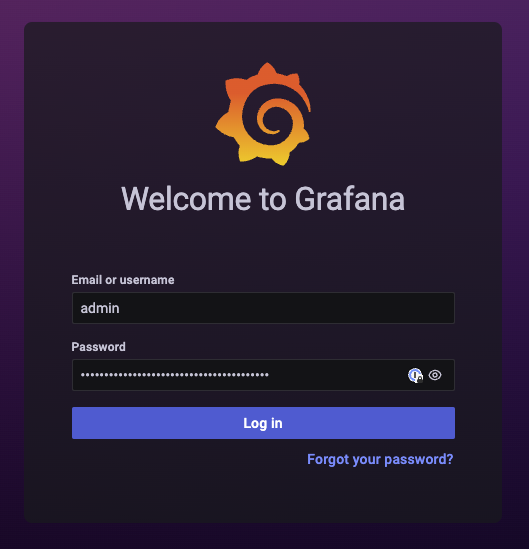
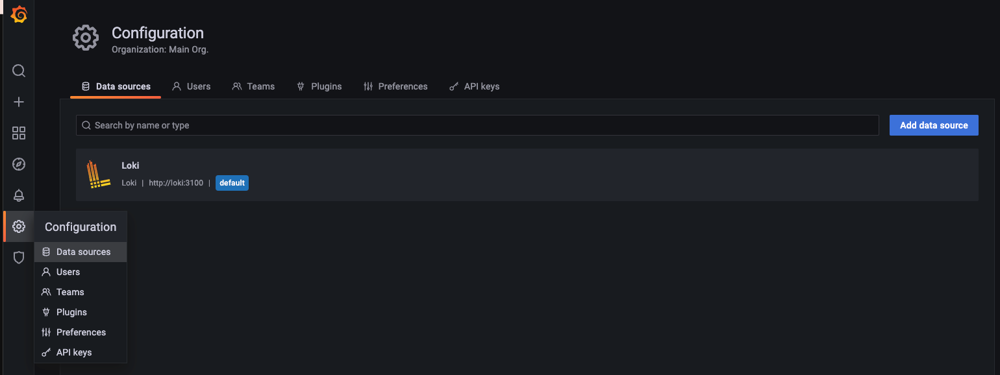
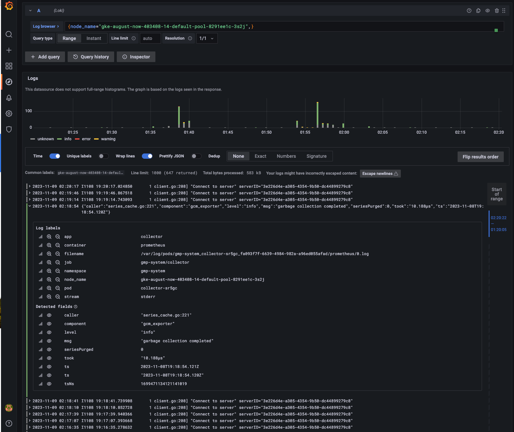
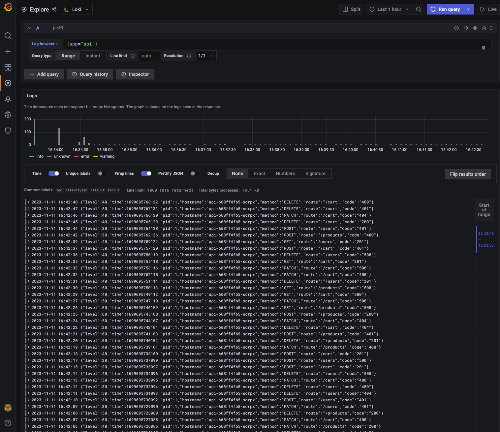

# Install the monolithic Helm chart

This Helm Chart installation runs the Grafana Loki *single binary* within a Kubernetes cluster.

## Before you begin: Software Requirements**

- Helm 3 or above. See [Installing Helm](https://helm.sh/docs/intro/install/).
- A running Kubernetes cluster

## Deploy Loki stack

1. Add [Grafana's chart repository](https://github.com/grafana/helm-charts) to Helm:

    ```bash
    helm repo add grafana https://grafana.github.io/helm-charts
    ```

1. Update the chart repository:

    ```bash
    helm repo update
    ```

1. Create the configuration file `values.yaml` from the default one

    ```bash
    helm show values grafana/loki-stack > values.yaml
    ```
1. Review and modify default values for `loki-stack` chart to enable `granafa`. 
   Leave other settings as default.
    ```yaml
    grafana:
      enabled: true
    ```
1. Deploy the Loki cluster.

    ```bash
    helm install --set grafana.enabled=true loki --namespace=loki --create-namespace grafana/loki-stack
    ```
1. Check the loki deployed resources
    ```
    kubectl get all -n loki
    ```

    ```
    NAME                                READY   STATUS        RESTARTS   AGE
    pod/loki-0                          1/1     Running       0          3m15s
    pod/loki-grafana-6d6bc57dc8-cc8q8   2/2     Running       0          3m15s
    pod/loki-logs-h7fml                 2/2     Terminating   0          21m
    pod/loki-logs-nc6rp                 2/2     Terminating   0          21m
    pod/loki-promtail-kbsz9             1/1     Running       0          3m15s
    pod/loki-promtail-sdj2v             1/1     Running       0          3m15s
    pod/loki-promtail-xl8bv             1/1     Running       0          3m15s

    NAME                      TYPE        CLUSTER-IP   EXTERNAL-IP   PORT(S)    AGE
    service/loki              ClusterIP   10.8.5.39    <none>        3100/TCP   3m17s
    service/loki-grafana      ClusterIP   10.8.7.191   <none>        80/TCP     3m17s
    service/loki-headless     ClusterIP   None         <none>        3100/TCP   3m17s
    service/loki-memberlist   ClusterIP   None         <none>        7946/TCP   3m17s

    NAME                           DESIRED   CURRENT   READY   UP-TO-DATE   AVAILABLE   NODE SELECTOR   AGE
    daemonset.apps/loki-promtail   3         3         3       3            3           <none>          3m16s

    NAME                           READY   UP-TO-DATE   AVAILABLE   AGE
    deployment.apps/loki-grafana   1/1     1            1           3m16s

    NAME                                      DESIRED   CURRENT   READY   AGE
    replicaset.apps/loki-grafana-6d6bc57dc8   1         1         1       3m16s

    NAME                    READY   AGE
    statefulset.apps/loki   1/1     3m16s
    ```

## Connecting to Grafana

1. Port-forwarding Granafa service
    ```bash
    kubectl port-forward svc/loki-grafana 3000:80
    ```

1. Get Grafana admin password
    ```bash
    kubectl -n loki get secret loki-grafana -ojsonpath="{.data.admin-password}" | base64 --decode
    ```

1. Connect to Grafana at http://localhost:3000

    

1. Go to **Configuration** -> **Data sources** , we will find out that Loki already added to Granafa

    

## Viewing Kubernetes logs

1. Go to ** Explore** and we could just verify that we are able to get log when we run the query. Let's check one Kubernetes Node log with a simple label `node_name`

    

1. Deploy the `loki-demo` application
    ```bash
    kubectl apply -f loki-demo.yaml
    ```

1. Explore the `api` pod log by a simple LogQL query 
    ```
    {app="api"}
    ```
    You should see the access log of the API application as below

    

1. Search for a certain log (like grep)
    ```
    {app="api"} |=`400`
    ```

## Promtail pipeline

What if we want `method` & `code` to be labels so we can easily run the advance queries to sum up all the error GET requests (code=5xx,method=GET)? We can do this by adding the promtail pipeline configuration.

1. Get the current `promtail.yaml`
    ```bash
    kubectl -n loki get secret loki-promtail -ojsonpath="{.data.promtail\.yaml}" | base64 --decode > promtail.yaml
    ```

1. Modify the configuration of `promtail`

    ```yaml
    scrape_configs:
    # See also https://github.com/grafana/loki/blob/master/production/ksonnet/promtail/scrape_config.libsonnet for reference
    - job_name: kubernetes-pods
        pipeline_stages:
        - cri: {}
    # Add these line
        - match:
            selecttor: '{app="api"}'
            stages:
                - json:
                    expressions:
                    log:
                - json:
                    source: log
                    expresions:
                    code: code
                    method: method
                - labels:
                    code:
                    label:
    # END
        kubernetes_sd_configs:
        - role: pod
        relabel_configs:
        - source_labels:
    ```
1. Update `promtail` secret
    ```bash
    kubectl -n loki delete secret loki-promtail
    kubectl -n loki create secret generic loki-promtail --from-file=./promtail.yaml
    ```

1. Rollout restart Loki Promtail daemonset
    ```bash
    kubectl rollout restart daemonset loki-promtail -n loki
    ```

