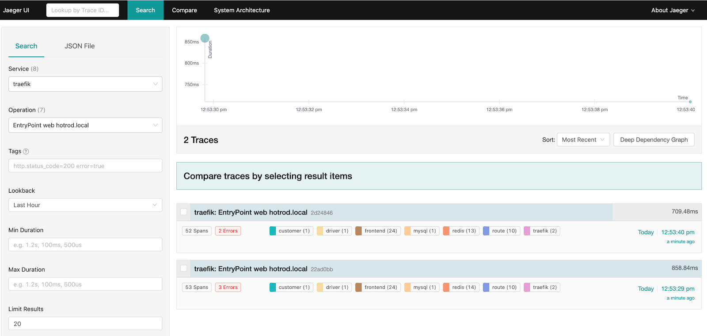

## What is distributed tracing?
Debugging anomalies, bottlenecks, and performance issues is a challenge in distributed architectures, such as microservices. Each user request typically involves the collaboration of many services to deliver the intended outcome. Because traditional monitoring methods like application logs and metrics tend to target monolithic applications, they can fail to capture the full performance trail for every request.

`Distributed Tracing`, therefore, is an important profiling technique that complements log monitoring and metrics. It captures the transaction flow distributed across various application components and services involved in processing a user request. The captured data can then be visualized to show which component malfunctioned and caused an issue, such as an error or bottleneck.

## Set up `distributed` tracing

1. First, you'll need to install and configure `Jaeger` on your Kubernetes cluster. The simplest way is to use the official Helm chart. As a first step, add the `jaegertracing` repository to your Helm repo list and update its contents:

    ```bash
    helm repo add jaegertracing https://jaegertracing.github.io/helm-charts
    helm repo update
    ```
2. The `Jaeger` repository provides two charts: `jaeger` and `jaeger-operator`. For the purpose of this lab, we deploy the `jaeger-operator` chart, which makes it easy to configure a minimal installation. To learn more about the Jaeger Operator for Kubernetes, consult the [official documentation](https://www.jaegertracing.io/docs/1.50/operator/).

    As it’s explained in the documentation, you’ll need to install `cert-manager` before installing this operator:

    ```
    kubectl apply -f https://github.com/cert-manager/cert-manager/releases/download/v1.13.2/cert-manager.yaml
    ```

3. And after, we can install jaeger-operator:

    ```bash
    helm install jaeger-op --set rbac.clusterRole=true jaegertracing/jaeger-operator
    ```

## Minimal deployment

1. For the sake of simplicity, we're going to deploy `Jaeger` with all-in-one topology using the below configuration, which will be sufficient to demonstrate the integration:

    ```yaml
    # jaeger.yaml
    apiVersion: jaegertracing.io/v1
    kind: Jaeger
    metadata:
    name: jaeger
    ```

2. The above configuration creates an instance named `jaeger`. It also creates a query-ui, an agent, and a collector. All these related services are prefixed with `jaeger`. It does not deploy a database like `Cassandra` or `Elastic`; instead, it relies on in-memory data processing.

    ```bash
    kubectl apply -f jaeger.yaml
    ```

3. You can confirm `Jaeger` is up & running by doing a lookup on this CRD and on deployed
services:
    ```bash
    kubectl get jaegers.jaegertracing.io

    NAME     STATUS    VERSION   STRATEGY   STORAGE   AGE
    jaeger   Running   1.49.0    allinone   memory    41s
    ```

    ```sh
    kubectl get services -l app=jaeger

    NAME                        TYPE        CLUSTER-IP   EXTERNAL-IP   PORT(S)                                                              AGE
    jaeger-agent                ClusterIP   None         <none>        5775/UDP,5778/TCP,6831/UDP,6832/UDP,14271/TCP                        2m10s
    jaeger-collector            ClusterIP   10.8.1.222   <none>        9411/TCP,14250/TCP,14267/TCP,14268/TCP,14269/TCP,4317/TCP,4318/TCP   2m10s
    jaeger-collector-headless   ClusterIP   None         <none>        9411/TCP,14250/TCP,14267/TCP,14268/TCP,14269/TCP,4317/TCP,4318/TCP   2m10s
    jaeger-query                ClusterIP   10.8.7.3     <none>        16686/TCP,16685/TCP,16687/TCP                                        2m10s
    ```
4. Now is also a good time to expose the Jaeger UI, which is served on port 16686:

    ```sh
    kubectl  port-forward service/jaeger-query 16686:16686
    ```

5. Access the Jaeger dashboard at http://localhost:16686/

    

## Install and configure Traefik Proxy

1. Now it's time to deploy `Traefik Proxy`, which you'll do using the official Helm chart. If you haven't already, add `Traefik Labs` to your Helm repository list using the below commands:

    ```
    helm repo add traefik https://traefik.github.io/charts
    helm repo update
    ```

1. Next, deploy the latest version of Traefik in the kube-system namespace. For this demo, however, the standard configuration of the Helm chart won't be enough. As part of the deployment, you need to ensure that Jaeger integration is enabled in Traefik. You do this by passing `additionalArguments` configuration flags in the `traefik-values.yaml` file:

    ```yaml
    tracing:
    jaeger:
        samplingServerURL: http://jaeger-agent.default.svc:5778/sampling
        localAgentHostPort: jaeger-agent.default.svc:6831
    ```
    As shown in the above configuration, you need to provide an address for the Jaeger agent. By default, this is `localhost`, and if you deploy jaeger-agent as a sidecar, this works as expected. In this deployment, however, you need to provide an explicit address for `jaeger-agent`, which corresponds to the `jaeger-agent.default.svc` hostname that was configured by the Helm chart.

    ```sh
    helm install traefik traefik/traefik -f ./traefik-values.yaml
    ```

1. Once the pods are created, you can verify the Jaeger integration by using port forwarding to expose the Traefik dashboard:

    ```
    kubectl port-forward $(kubectl get pods --selector "app.kubernetes.io/name=traefik" --output=name) 9000:9000
    ```
    If you access the Traefik dashboard at http://localhost:9000/dashboard/, you will see that Jaeger distributed tracing is enabled under the **Features** section:

    


## Deploy Hot R.O.D.

Now that your integration is working, you need an application to trace. For this purpose, let’s deploy `Hot R.O.D. - Rides On Demand`, which is an example application created by the Jaeger team. It is a demo ride-booking service that consists of three microservices: `driver-service`, `customer-service`, and `route-service`. Each service also has accompanying storage, such as a MySQL database or Redis cache.

The application includes four pre-built "customer personas" who can book a ride using the application UI. When a car is booked, the application will find a driver and dispatch the car.

Throughout the process, Jaeger will capture the user request as it flows through the various services (`driver-service`, `customer-service`, `route-service`). Individual service handling will be shown as a span, and all related spans are visualized in a graph known as the trace.

1. Deploy the Service along with the IngressRoute using this following configuration file:
    ```sh
    kubectl apply -f hotrod.yaml
    ```

2. The hotrod route will match the hostname hotrod.localhost, which allows you to open the application UI on http://hotrod.localhost:8000/.

    
    


## Application traces

1. To see `Jaeger` in action, send a few user requests to the application using a sample customer persona. For example, try the following curl commands:

    ```sh
    curl -I "http://hotrod.localhost:8000/dispatch?customer=392"
    curl -I "http://hotrod.localhost:8000/dispatch?customer=123"
    ```
    Each command triggers a sequence of requests to produce the expected result. You can see the generated traces in the Jaeger UI when you select `traefik` as the **Service** and `localhost` as the **Operation** and click **Find Traces**:

    

2. Select either of the traces to explore the detailed request flow.

    

    The display above shows the top two spans expanded to show the information forwarded by Traefik Proxy. Each span shows the request duration, along with non-mandatory sections for Tags, Process, and Logs. The **Tags** section contains key-value pairs that can be associated with request handling.

    The **Tags** field of the topmost traefik span shows information related to HTTP handling, such as the status code, URL, host, and so on. The next span shows the routing information for the request, including the router and service names.

3. Jaeger can also deduce an overall architecture by analyzing the request traces. This diagram is available under the **System Architecture** > **DAG** tab:

    

    The graph shows that you made two requests, which were routed to the `frontend` service. The `frontend` service then fanned out requests to the `customer`, `driver`, and `route` services.

    Returning to the **Search** tab of the Jaeger UI, you can see that in the current cluster, you have traces generated for the following three entrypoints :

    - `traefik-dashboard`, which you used for lookup
    - `ping api`, used by Kubernetes for health checks
    - `hotrod.localhost`, used by the Hot R.O.D. application

    As you deploy more applications to your cluster, you will see more entries in the Operations drop-down, based on the entrypoint match.

