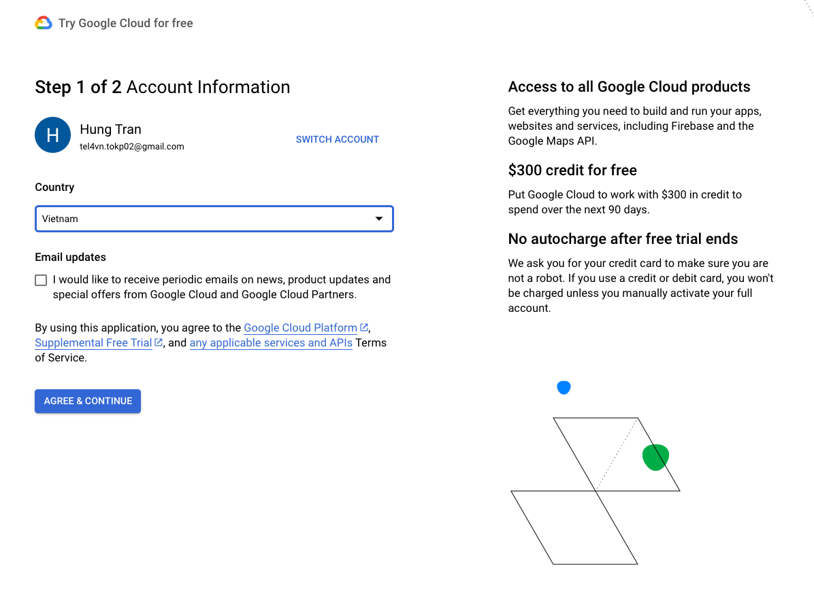

# advanced-k8s-course


Here's a simple README file that outlines the prerequisites for creating a lab environment by registering for a GCP free trial account:

## Lab Environment Setup using GCP Free Trial
This README provides a step-by-step guide to set up a lab environment using Google Cloud Platform (GCP) Free Trial. Follow the instructions below to register for a free trial and prepare your environment for hands-on practice.

## Prerequisites
Before you can create your lab environment, ensure you have the following:

1. Google Account
- Requirement: A valid Google account.
- Sign Up: If you don't have a Google account, you can create one here.
2. Internet Access
- Requirement: Stable internet connection.
- Purpose: Required for accessing GCP services and managing your cloud resources.

3. Payment Method
- Requirement: A valid credit or debit card.
- Note: Google Cloud Platform requires a payment method to start the free trial, but you won’t be charged until you upgraded to the paid account.

## Step-by-Step Guide
### Register for GCP Free Trial

1. Create a Gmail account if not available

https://accounts.google.com/SignUp


2. Create GCP Free Trial account

- Switch to your google account
- Access to https://cloud.google.com/
- Hit `Start free` on the top right corner


- Step 1:



- Step 2: The Account Type must be `Individual`


- Step 3: Payment Verification / Survey


### Set Up Your Lab Environment

#### Create GKE Cluster

- Set a default compute zone:
```
gcloud config set compute/zone asia-southeast1-c
```

- Enable GKE services in our current project
```
gcloud services enable container.googleapis.com
Operation "operations/acf.p2-992714546140-656169a8-750c-4e5f-b347-c641af14a3ad" finished successfully.
```

- Tell GKE to create a single zone, three node cluster for us. 3 is the default size. We're disabling basic authentication as it's no longer supported after 1.19 in GKE. It will take some time to create a cluster.

```
gcloud container clusters create gke-test --no-enable-basic-auth

Default change: VPC-native is the default mode during cluster creation for versions greater than 1.21.0-gke.1500. To create advanced routes based clusters, please pass the `--no-enable-ip-alias` flag
Default change: During creation of nodepools or autoscaling configuration changes for cluster versions greater than 1.24.1-gke.800 a default location policy is applied. For Spot and PVM it defaults to ANY, and for all other VM kinds a BALANCED policy is used. To change the default values use the `--location-policy` flag.
Note: Your Pod address range (`--cluster-ipv4-cidr`) can accommodate at most 1008 node(s).
Creating cluster gke-test in asia-southeast1-c... Cluster is being configured...working
Creating cluster gke-test in asia-southeast1-c... Cluster is being health-checked (master is healthy)...done.                                                                                                         
Created [https://container.googleapis.com/v1/projects/red-grid-394709/zones/asia-southeast1-c/clusters/gke-test].
To inspect the contents of your cluster, go to: https://console.cloud.google.com/kubernetes/workload_/gcloud/asia-southeast1-c/gke-test?project=red-grid-394709
kubeconfig entry generated for gke-test.
NAME: gke-test
LOCATION: asia-southeast1-c
MASTER_VERSION: 1.27.3-gke.100
MASTER_IP: 35.247.172.185
MACHINE_TYPE: e2-medium
NODE_VERSION: 1.27.3-gke.100
NUM_NODES: 3
STATUS: RUNNING
```

- Get our credentials for kubectl
```
gcloud container clusters get-credentials gke-test

Fetching cluster endpoint and auth data.
kubeconfig entry generated for gke-test.
```

- Check out lists of kubectl contexts
```
kubectl config get-contexts

CURRENT   NAME                                             CLUSTER                                          AUTHINFO                                         NAMESPACE
*         gke_red-grid-394709_asia-southeast1-c_gke-test   gke_red-grid-394709_asia-southeast1-c_gke-test   gke_red-grid-394709_asia-southeast1-c_gke-test  
```

- Set our current context to the GKE context, you may need to update this to your cluster context name.
```
kubectl config use-context gke_red-grid-394709_asia-southeast1-c_gke-test
Switched to context "gke_red-grid-394709_asia-southeast1-c_gke-test".
```

- Run a command to communicate with our cluster.
```
kubectl get nodes
NAME                                      STATUS   ROLES    AGE    VERSION
gke-gke-test-default-pool-03d0c6b2-bfk0   Ready    <none>   3m1s   v1.27.3-gke.100
gke-gke-test-default-pool-03d0c6b2-n7l2   Ready    <none>   3m1s   v1.27.3-gke.100
gke-gke-test-default-pool-03d0c6b2-sv8f   Ready    <none>   3m1s   v1.27.3-gke.100
```

- Delete our GKE cluster
```
gcloud container clusters delete gke-test
```