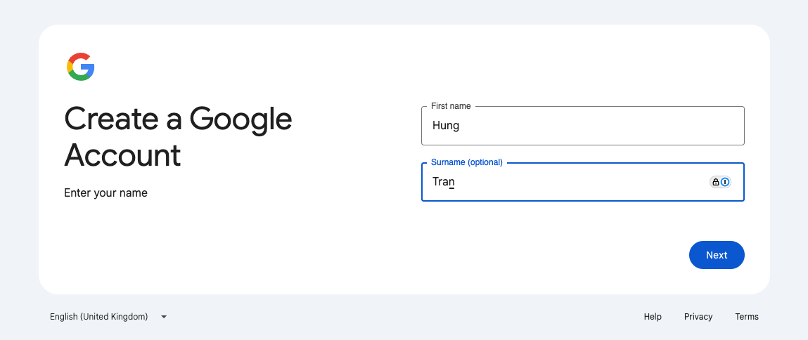
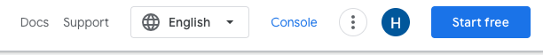
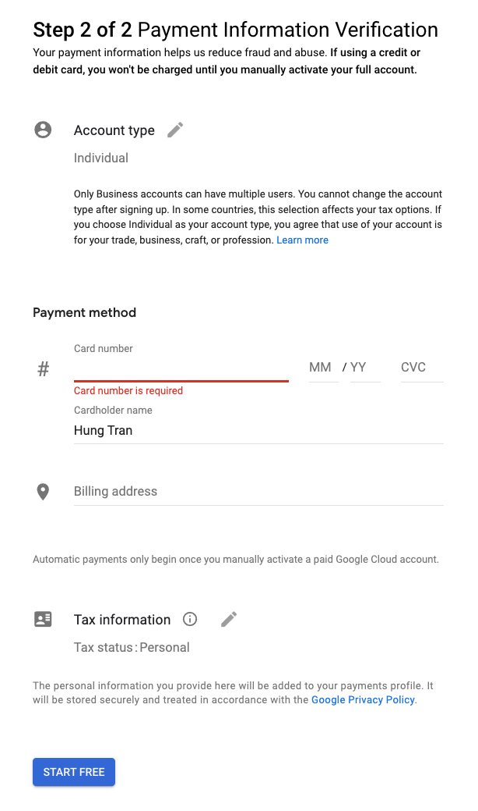
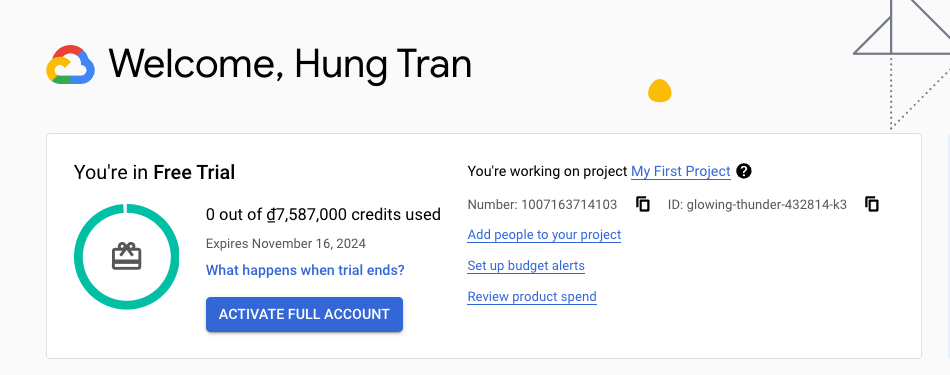
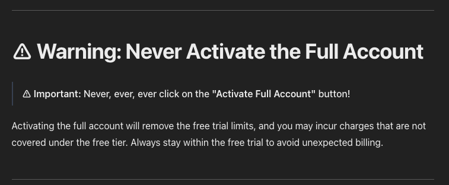

# advanced-k8s-course

Here's a simple README file that outlines the prerequisites for creating a lab environment by registering for a GCP free trial account:

## Lab Environment Setup using GCP Free Trial
This README provides a step-by-step guide to set up a lab environment using Google Cloud Platform (GCP) Free Trial. Follow the instructions below to register for a free trial and prepare your environment for hands-on practice.

## Prerequisites
Before you can create your lab environment, ensure you have the following:

1. Google Account
- Requirement: A valid Google account.
- Sign Up: If you don't have a Google account, you can create one here.
2. Internet Access
- Requirement: Stable internet connection.
- Purpose: Required for accessing GCP services and managing your cloud resources.

3. Payment Method
- Requirement: A valid credit or debit card.
- Note: Google Cloud Platform requires a payment method to start the free trial, but you won’t be charged until you upgraded to the paid account.

## Step-by-Step Guide
### Register for GCP Free Trial

1. Create a Gmail account if not available

https://accounts.google.com/SignUp

2. Create GCP Free Trial account

- Switch to your google account
- Access to https://cloud.google.com/
- Hit `Start free` on the top right corner

- Step 1:

- Step 2: The Account Type must be `Individual`

- Step 3: Payment Verification / Survey

### Set Up Your Lab Environment
