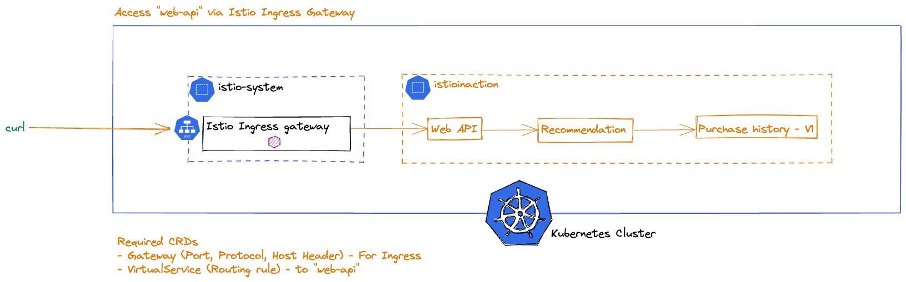
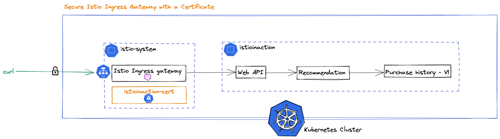

# Istio Ingress Gateway
In this lab, you will deploy a sample application to your Kubernetes cluster, expose the `web-api` service to the Istio ingress gateway, and configure secure access to the service. The ingress gateway allows traffic into the mesh. If you need more sophisticated edge gateway capabilities (such as request transformation, OIDC, LDAP, OPA, etc.) then you should use a gateway specifically built for those use cases like Gloo Edge.

## Prerequisites

### Install `smallstep` tool
https://smallstep.com/docs/step-cli/installation/index.html
```sh
brew install step
```

Generate CA and certificates
```sh
cd labs/02/certs
./generate-ca.sh
./generate-certs.sh
```
Verify you're in the correct folder for this lab: `lab3/istio-basics`. 
```sh
cd lab3/istio-basics
```

## Deploy the sample application
You will use the `web-api`, `recommendation`, and `purchase-history` services built using the fake service as your sample application. The `web-api` service calls the `recommendation` service via HTTP, and the `recommendation` service calls the `purchase-history` service, also via HTTP.

1. Set up the istioinaction namespace for our services:

    ```
    kubectl create ns istioinaction
    ```

2. Deploy the web-api, recommendation and purchase-history services along with the sleep service into the istioinaction namespace:

    ```
    kubectl apply -n istioinaction -f sample-apps/web-api.yaml
    kubectl apply -n istioinaction -f sample-apps/recommendation.yaml
    kubectl apply -n istioinaction -f sample-apps/purchase-history-v1.yaml
    kubectl apply -n istioinaction -f sample-apps/sleep.yaml
    ```

3. After running these commands, you should check that all pods are running in the istioinaction namespace:

    ```
    kubectl get po -n istioinaction
    ```
    Wait a few seconds until all of them show a `Running` status.

## Configure the inbound traffic
1. The Istio ingress gateway will create a Kubernetes Service of type LoadBalancer. Use this GATEWAY_IP address to reach the gateway:

    ```
    kubectl get svc -n istio-system
    ```

2. Store the ingress gateway IP address in an environment variable.


    ```
    export GATEWAY_IP=$(kubectl get svc -n istio-system istio-ingressgateway -o jsonpath="{.status.loadBalancer.ingress[0].ip}")
    export INGRESS_PORT=80
    export SECURE_INGRESS_PORT=443
    ```

## Expose our apps




Even though you don't have apps defined in the istioinaction namespace in the mesh yet, you can still use the Istio ingress gateway to route traffic to them. Using Istio's Gateway resource, you can configure what ports should be exposed, what protocol to use, etc. Using Istio's VirtualService resource, you can configure how to route traffic from the Istio ingress gateway to your web-api service.

1. Review the Gateway resource:

    ```
    cat sample-apps/ingress/web-api-gw.yaml
    ```

2. Review the VirtualService resource:

    ```
    cat sample-apps/ingress/web-api-gw-vs.yaml
    ```

    Why is port number 8080 shown in the destination route configuration for the web-api-gw-vs VirtualService resource? Check the service port for the web-api service in the istioinaction namespace:

    ```
    kubectl get service web-api -n istioinaction
    ```
    You can see the service listens on port 8080.

3. Apply the Gateway and VirtualService resources to expose your web-api service outside of the Kubernetes cluster:

    ```
    kubectl -n istioinaction apply -f sample-apps/ingress/
    ```

4. The Istio ingress gateway will create new routes on the proxy that you should be able to call from outside of the Kubernetes cluster:

    ```
    curl -H "Host: istioinaction.io" http://$GATEWAY_IP:$INGRESS_PORT
    ```

5. Query the gateway configuration using the istioctl proxy-config command:

    ```
    istioctl proxy-config routes deploy/istio-ingressgateway.istio-system
    ```

6. If you want to see an individual route, you can ask for its output as json like this:

    ```
    istioctl proxy-config routes deploy/istio-ingressgateway.istio-system --name http.8080 -o json
    ```

## Secure the inbound traffic



To secure inbound traffic with HTTPS, you need a certificate with the appropriate SAN and you will need to configure the Istio ingress-gateway to use it.

1. Create a TLS secret for istioinaction.io in the istio-system namespace:

    ```
    kubectl create -n istio-system secret tls istioinaction-cert --key labs/02/certs/istioinaction.io.key --cert labs/02/certs/istioinaction.io.crt
    ```

2. Update the Istio ingress-gateway to use this cert:

    ```
    cat labs/02/web-api-gw-https.yaml
    ```

Note, we are pointing to the istioinaction-cert and that the cert must be in the same namespace as the ingress gateway deployment. Even though the Gateway resource is in the istioinaction namespace, the cert must be where the gateway is actually deployed.

3. Apply the web-api-gw-https.yaml in the istioinaction namespace. Since this gateway resource is also called web-api-gateway, it will replace our prior web-api-gateway configuration for port 80.

    ```
    kubectl -n istioinaction apply -f labs/02/web-api-gw-https.yaml
    ```

4. Call the web-api service through the Istio ingress-gateway on the secure 443 port:

    ```
    curl --cacert ./labs/02/certs/ca/root-ca.crt -H "Host: istioinaction.io" https://istioinaction.io:$SECURE_INGRESS_PORT --resolve istioinaction.io:$SECURE_INGRESS_PORT:$GATEWAY_IP
    ```

5. If you call it on the 80 port with http, it will not work as you no longer have the gateway resource configured to be exposed on port 80.

    ```
    curl -H "Host: istioinaction.io" http://$GATEWAY_IP:$INGRESS_PORT
    ```

## Mesh Metrics
Now that we have an Istio gateway running and receiving traffic, we can now visualize information about the traffic we just generated.

Click on the Grafana UI tab and we should start to see some mesh metrics appearing.

