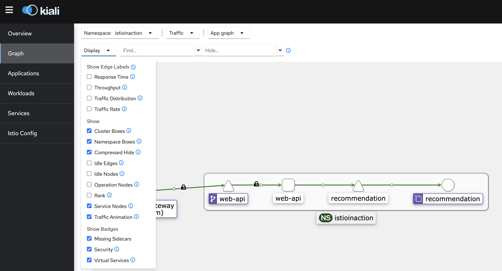

# Securing Communication Within Istio
In the previous lab, you explored adding services into a mesh. When you installed Istio using the demo profile, it is using a `permissive` security mode. The Istio `permissive` security setting is useful when you have services that are being moved into the service mesh incrementally, as it allows both `plaintext` and `mTLS` traffic. In this lab, you will explore how Istio manages secure communication between services and how to require strict security between services in the sample application.

## Prerequisites

Verify you're in the correct folder for this lab: `/istio-basics`. 

This lab builds on earlier work where you added your services to the mesh.

```
cd lab3/istio-basics
```

## Permissive mode
By default, Istio automatically upgrades the connection securely from the source service's sidecar proxy to the target service's sidecar proxy. While it is probably ok when onboarding your services to your Istio service mesh to have communications between source and target services allowed via plain text if mutual TLS communication fails, you wouldn't want this in a production environment. You need to have a proper security policy in place.

Check if you have a peerauthentication policy in any of your namespaces:

```
kubectl get peerauthentication --all-namespaces
```

You should see `No resources found` in the output, which means no peer authentication has been specified and the default `PERMISSIVE` mTLS mode is being used.

## Enable strict mTLS
1. You can lock down access to the services in your Istio service mesh to securely require `mTLS` using a peer authentication policy. Execute this command to define a default policy for the `istio-system` namespace that updates all of the servers to accept only mTLS traffic:

    ```
    kubectl apply -n istio-system -f - <<EOF
    apiVersion: "security.istio.io/v1beta1"
    kind: "PeerAuthentication"
    metadata:
      name: "default"
    spec:
      mtls:
        mode: STRICT
    EOF
    ```

2. Verify your peerauthentication policy is installed:

      ```
      kubectl get peerauthentication --all-namespaces
      ```

    You should see the the default peerauthentication policy installed in the istio-system namespace with STRICT mTLS enabled:

    ```
    NAMESPACE      NAME      MODE     AGE
    istio-system   default   STRICT   84s
    ```
    Because the `istio-system` namespace is also the Istio mesh configuration root namespace in your environment, this `peerauthentication` policy is the default policy for all of your services in the mesh regardless of which namespaces your services run.

3. You can send some traffic to `web-api` from a pod that is not part of the Istio service mesh. Deploy the `sleep` service and pod in the default namespace:

    ```
    kubectl apply -n default -f sample-apps/sleep.yaml
    ```

4. Access the web-api service from the sleep pod in the default namespace:

    ```
    kubectl exec deploy/sleep -n default -- curl http://web-api.istioinaction:8080/
    ```
    The request will fail because the `web-api` service can only be accessed with mutual TLS connections. The `sleep` pod in the `default` namespace doesn't have the sidecar proxy, so it doesn't have the needed keys and certificates to communicate to the `web-api` service via mutual TLS. Otherwise, you need to remove the istio-inject label as below:

    ```
    kubectl label namespace default istio-injection-
    ```

5. Run the same command from the `sleep` pod in the `istioinaction` namespace:

    ```
    kubectl exec deploy/sleep -n istioinaction -- curl http://web-api.istioinaction:8080/
    ```
    You should now see the request succeed.

## Visualize `mTLS` enforcement in `Kiali`
You can visualize the services in the mesh in Kiali.

1. Generate some load to the data plane (by calling our `web-api` service) so that you can observe interactions among your services:

    ```
    for i in {1..200};
      do curl --cacert ./labs/02/certs/ca/root-ca.crt -H "Host: istioinaction.io" https://istioinaction.io:$SECURE_INGRESS_PORT  --resolve istioinaction.io:$SECURE_INGRESS_PORT:$GATEWAY_IP;
      sleep 3;
    done
    ```
2. Navigate to the Kiali tab and select the `Graph` tab.

    On the `"Namespace"` dropdown, select `"istioinaction"`. On the `"Display"` drop down, select `"Traffic Animation"` and `"Security"`.

    

3. You should observe the service interaction graph with some traffic animation and security badges.

4. Return to the Terminal tab and enter `ctrl+c` to end the load generation.

## Understand how mTLS works in Istio service mesh
1. Inspect the key and/or certificates used by Istio for the web-api service in the istioinaction namespace:

    ```
    istioctl proxy-config secret deploy/web-api -n istioinaction
    ```
    From the output, you'll see the `default` secret and your Istio service mesh's root CA public certificate.

    The `default` secret containers the public certificate information for the `web-api` service. You can analyze the contents of the default secret using openssl.

2. Check the issuer of the public certificate:

    ```
    istioctl proxy-config secret deploy/web-api -n istioinaction -o json | jq '[.dynamicActiveSecrets[] | select(.name == "default")][0].secret.tlsCertificate.certificateChain.inlineBytes' -r | base64 -d | openssl x509 -noout -text | grep 'Issuer'
    ```

    ```
           Issuer: O = cluster.local
    ```

3. Check if the public certificate in the `default` secret is valid:

    ```
    istioctl proxy-config secret deploy/web-api -n istioinaction -o json | jq '[.dynamicActiveSecrets[] | select(.name == "default")][0].secret.tlsCertificate.certificateChain.inlineBytes' -r | base64 -d | openssl x509 -noout -text | grep 'Validity' -A 2
    ```
    You should see the public certificate is valid and expires in 24 hours.

    ```
            Validity
                Not Before: Nov  4 00:15:05 2023 GMT
                Not After : Nov  5 00:17:05 2023 GMT
    ```

4. Validate the identity of the client certificate is correct:
    ```
    istioctl proxy-config secret deploy/web-api -n istioinaction -o json | jq '[.dynamicActiveSecrets[] | select(.name == "default")][0].secret.tlsCertificate.certificateChain.inlineBytes' -r | base64 -d | openssl x509 -noout -text | grep 'Subject Alternative Name' -A 1
    ```

    ```
            X509v3 Subject Alternative Name: critical
                URI:spiffe://cluster.local/ns/istioinaction/sa/web-api
    ```

You should see the identity of the `web-api` service. Note it is using the `SPIFFE` format, e.g. `spiffe://{my-trust-domain}/ns/{namespace}/sa/{service-account}`.

## Understand the SPIFFE format used by Istio
Where do the `cluster.local` and `web-api` values come from? Check the `istio` configmap in the `istio-system` namespace:

```
kubectl get cm istio -n istio-system -o yaml | grep trustDomain -m 1
```
You'll see cluster.local returned as the trustDomain value, per the installation of your Istio using the demo profile.

  ```
  trustDomain: cluster.local
  ```
If you review the `sample-apps/web-api.yaml` file, you will see the `web-api` service account in there.

```
cat sample-apps/web-api.yaml | grep ServiceAccount -A 3

kind: ServiceAccount
metadata:
  name: web-api
---
```

How does the `web-api` service obtain the needed key and/or certificates?

Earlier, you reviewed the injected `istio-proxy` container for the `web-api` pod. Recall there are a few volumes mounted to the `istio-proxy` container.
```yaml
      volumeMounts
      - mountPath: /var/run/secrets/istio
        name: istiod-ca-cert
      - mountPath: /var/lib/istio/data
        name: istio-data
      - mountPath: /etc/istio/proxy
        name: istio-envoy
      - mountPath: /var/run/secrets/tokens
        name: istio-token
      - mountPath: /etc/istio/pod
        name: istio-podinfo
      - mountPath: /var/run/secrets/kubernetes.io/serviceaccount
        name: web-api-token-ztk5d
        readOnly: true
...
    - name: istio-token
      projected:
        defaultMode: 420
        sources:
        - serviceAccountToken:
            audience: istio-ca
            expirationSeconds: 43200
            path: istio-token
    - configMap:
        defaultMode: 420
        name: istio-ca-root-cert
      name: istiod-ca-cert
    - name: web-api-token-ztk5d
      secret:
        defaultMode: 420
        secretName: web-api-token-ztk5d
```
The `istio-ca-cert` mounted volume is from the `istio-ca-root-cert` configmap in the `istioinaction` namespace. During start up time, Istio agent (also called `pilot-agent`) creates the private key for the `web-api` service and then sends the `certificate signing request` (CSR) for the `Istio CA` (Istio control plane is the Istio CA in your installation) to sign the private key, using the `istio-token` and the `web-api` service's service account token `web-api-token-ztk5d` as credentials. The Istio agent sends the certificates received from the Istio CA along with the private key to the Envoy Proxy via the `Envoy SDS API`.

You noticed earlier that the certificate expires in `24 hours`. What happens when the certificate expires? The Istio agent monitors the `web-api` certificate for expiration and repeats the CSR request process described above periodically to ensure each of your workload's certificate is still valid.

## How is `mTLS` strict enforced?

When `mTLS` strict is enabled, you will find the Envoy Proxy configuration for the `istio-proxy` container actually has fewer lines of configurations. This is because when `mTLS` strict is enabled, you would only allow `mTLS` traffic and therefore don't need or want filter chain configurations to allow plain text traffic to services in the mesh (hint: search for "transport_protocol": "raw_buffer" in your Envoy configuration when PERMISSIVE mode is applied). If you are curious to explore Envoy configuration for any of your pod, you can use the command below to view the configuration for the `istio-proxy` container of the `web-api` pod.

```
istioctl proxy-config all deploy/web-api -n istioinaction -o json
```