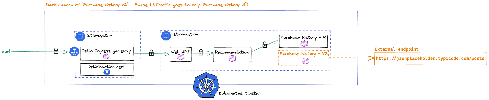
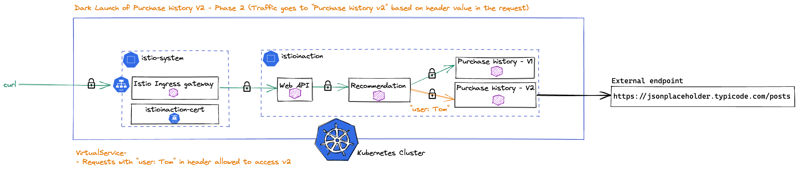
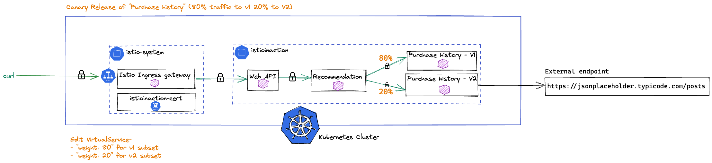

# Control Traffic

You are now ready to take control of how traffic flows between your services. In a Kubernetes environment, there is simple `round-robin` load balancing between service endpoints. While Kubernetes does support rolling upgrades, this is fairly coarse-grained and is limited to moving to a new version of the service. You may find it necessary to `dark launch` a new version, then `canary` test your new version with some portion of requests before shifting all traffic to it. You will now explore many of the Istio features which control the traffic between services while increasing the resiliency.

## Prerequisites
Verify you're in the correct folder for this lab: `/istio-basics`. This lab builds on the earlier lab where you enforced `mTLS` for your services in the mesh.
```
cd istio-basics
```

## Dark Launch



You may find the v1 of the `purchase-history` service is rather boring as it always return the `Hello From Purchase History (v1)!` message. You want to make a new version of the `purchase-history` service so that it returns dynamic messages based on the result from querying an external service, for example the [JsonPlaceholder](https://jsonplaceholder.typicode.com/) service.

Dark launch allows you to deploy and test a new version of a service while minimizing the impact to your users, e.g. you can keep the new version of the service in the dark. Using a dark launch approach enables you to deliver new functions rapidly with reduced risk. Istio allows you to preceisely control how new versions of services are rolled out without the need to make any code change to your services or redeploy your services.

1. You have `v2` of the `purchase-history` service ready in the `labs/05/purchase-history-v2.yaml` file:

    ```
    cat labs/05/purchase-history-v2.yaml
    ```

    The main changes are the `purchase-history-v2` deployment name and the `version:v2` labels, along with the `fake-service:v2` image and the newly added `EXTERNAL_SERVICE_URL` environment variable. The p`urchase-history-v2` pod establishes the connection to the external service at startup time and obtains a random response from the external service when clients call the v2 of the `purchase-history` service.

    Should you deploy the `labs/05/purchase-history-v2.yaml` to your Kubernetes cluster next? What percentage of the traffic will visit v1 and v2 of the purchase-history services? Because both of the deployments have `replicas: 1`, you will see `50%` traffic goes to `v1` and `50%` traffic goes to `v2`. This is probably not what you would want because you haven't had a chance to test `v2` in your Kubernetes cluster yet.

    You can use Istio's networking resources to dark launch the `v2` of the `purchase-history` service. Virtual Service gives you the ability to configure a list of routing rules that control how your Envoy Proxy routes requests to services within the service mesh. The client could be Istio's `ingress-gateway` or any of your other services in the mesh. In a previous lab, when the client is `istio-ingressgateway`, the virtual service is bound to the `web-api-gateway` gateway. If you recall the `Kiali` graph for our application from the prior lab, the client for the `purchase-history` service in your application is the `recommendation` service.

    A `destination rule` allows you to define configurations of policies that are applied to a request after the routing rules are enforced as defined in the destination `virtual service`. In addition, a `destination rule` is also used to define the set of Kubernetes pods that belong to a specific grouping, for example multiple versions of a service, which are called `subsets` in Istio.

2. You can review the virtual service resource for the `purchase-history` service that configures all traffic to `v1` of the `purchase-history` service:

    ```
    cat labs/05/purchase-history-vs-all-v1.yaml
    ```

3. Also review the destination rule resource for the `purchase-history` service that defines the `v1` and `v2` subsets. Since `v2` is dark-launched and no traffic will go to `v2`, it is not required to have `v2` subsets now but you will need them soon.

    ```
    cat labs/05/purchase-history-dr.yaml
    ```

4. Apply the `purchase-history-vs` and `purchase-history-dr` resources in the `istioinaction` namespace:

    ```
    kubectl apply -f labs/05/purchase-history-vs-all-v1.yaml -n istioinaction
    kubectl apply -f labs/05/purchase-history-dr.yaml -n istioinaction
    ```
5. After you have configured Istio to send 100% of traffic to `purchase-history` to `v1` of the service, you can now deploy the `v2` of the `purchase-history` service:

    ```
    kubectl apply -f labs/05/purchase-history-v2.yaml -n istioinaction
    ```
6. Confirm the new v2 `purchase-history` pod is running:

    ```
    kubectl get pods -n istioinaction -l app=purchase-history
    ```
    You should see both `v1` and `v2` of the `purchase-history` pods are running, each with its own sidecar proxy.

7. Make some requests to the `purchase-history` application

    ```
    for i in {1..10}; 
      do curl -s --cacert ./labs/02/certs/ca/root-ca.crt -H "Host: istioinaction.io" https://istioinaction.io:$SECURE_INGRESS_PORT --resolve istioinaction.io:$SECURE_INGRESS_PORT:$GATEWAY_IP|grep "Hello From Purchase History"; 
      done
    ```
    You will see all of the responses from `purchase-history` are from `v1` of the service. This is great! We introduced the `v2` service but it is currently not yet routable. Let us verify its health and start sending traffic.

### Verify purchase-history-v2

Recall the `v2` of the `purchase-history` service has some code to call the external service and requires the ability for the pod to connect to the external service during initialization. By default in Istio, the `istio-proxy` starts in parallel with the application container (`purchase-history-v2` here in our example) so it is possible that the application container is running before istio-proxy fully starts, and it could be unable to connect to any external services outside of the cluster yet.

1. Check the `purchase-history-v2` pod logs to see if there are any errors:
    ```
    kubectl logs deploy/purchase-history-v2 -n istioinaction
    ```

    Note the connection refused error at the beginning of the log during the service initialization.

    This is not good, the `purchase-history-v2` pod cannot reach the `JsonPlaceHolder` external service at startup time. Generate some load on the `web-api` service to ensure your users are not impacted by the newly added `v2` of the `purchase-history` service:

2. How can we solve this problem and ensure the application container can connect to services outside of the cluster during the container start time? The `holdApplicationUntilProxyStarts` configuration is introduced in Istio to solve this problem. Let us add this configuration to the pod annotation of the `purchase-history-v2` and use it:

    ```
    cat labs/05/purchase-history-v2-updated.yaml
    ```
    From the `holdApplicationUntilProxyStarts` annotation below, you have configured the `purchase-history-v2` pod to delay starting until the `istio-proxy` container reaches its `Running` status:

      ```yaml
      template:
        metadata:
          labels:
            app: purchase-history
            version: v2
          annotations:
            proxy.istio.io/config: '{ "holdApplicationUntilProxyStarts": true }'
        spec:
      ```

3. Deploy the updated `v2` of the `purchase-history` service:

    ```
    kubectl apply -f labs/05/purchase-history-v2-updated.yaml -n istioinaction
    ```

4. Check the `purchase-history-v2` pod logs to see to ensure there are no errors this time:

    ```
    kubectl logs deploy/purchase-history-v2 -n istioinaction
    ```
    You will see we are able to connect to the external service in the log:

    ```    
    2021-06-11T18:13:03.573Z [INFO]  Able to connect to : https://jsonplaceholder.typicode.com/posts=<unknown>
    ```

5. Test the `v2` of the `purchase-history` service from its own sidecar proxy:

    ```
    kubectl exec deploy/purchase-history-v2 -n istioinaction -c istio-proxy -- curl -s localhost:8080
    ```

    Awesome! You are getting a valid response this time. If you rerun the above command, you will notice a slightly different body from purchase-history-v2 each time.
    ```
    "body": "Hello From Purchase History (v2)! + History: 24 Title: autem hic labore sunt dolores incidunt Body: autem hic labore sunt dolores incidunt",
    "code": 200
    ```
### Selectively Route Requests


1. You want to test the `v2` of the `purchase-history` service only from a specific test user while all other requests continue to route to the `v1` of the `purchase-history` service. With Istio's virtual service resource, you can specify HTTP routing rules based on HTTP requests such as header information. In the `purchase-history-vs-all-v1-header-v2.yaml` file shown in the following example, you will see that an HTTP route rule has been defined to route requests from clients using user: Tom header to the v2 of the `purchase-history` service. All other client requests will continue to use the v1 subset of the `purchase-history` service:

    ```
    cat labs/05/purchase-history-vs-all-v1-header-v2.yaml
    ```

2. Review the changes of the `purchase-history-vs` virtual service resource. Apply the changes to your mesh using this command:

    ```
    kubectl apply -f labs/05/purchase-history-vs-all-v1-header-v2.yaml -n istioinaction
    ```

3. Send some traffic to the `web-api` service through the `istio-ingressgateway`:

    ```
    curl --cacert ./labs/02/certs/ca/root-ca.crt -H "Host: istioinaction.io" -H "user: mark" https://istioinaction.io:$SECURE_INGRESS_PORT --resolve istioinaction.io:$SECURE_INGRESS_PORT:$GATEWAY_IP
    ```

4. You will get `Hello From Purchase History (v1)!` in the response. Why is that? Recall we configured exact in `exact: Tom` earlier. Change the command using `user: Tom` instead:

    ```
    curl --cacert ./labs/02/certs/ca/root-ca.crt -H "Host: istioinaction.io" -H "user: Tom" https://istioinaction.io:$SECURE_INGRESS_PORT --resolve istioinaction.io:$SECURE_INGRESS_PORT:$GATEWAY_IP
    ```
    You should see `Hello From Purchase History (v2)!` in the response! Feel free to send a few more requests. Based on your routing rule configuration, Istio made sure that requests with header `user: Tom` always route to the `v2` of the `purchase-history` service while all other requests continue to route to `v1` of the `purchase-history` service.

## Canary Testing
You have dark-launched and done some basic testing of the `v2` of the `purchase-history` service. You want to canary test a small percentage of requests to the new version to determine whether there are problems before routing all traffic to the new version. Canary tests are often performed to ensure the new version of the service not only functions properly but also doesn't cause any degradation in performance or reliability.

### Shift `20%` Traffic to `v2`



1. Review the updated purchase-history virtual service resource that shifts `20%` of the traffic to `v2` of the `purchase-history` service:

    ```
    cat labs/05/purchase-history-vs-20-v2.yaml
    ```

    You will notice subset: `v2` is added which will get `20%` of the traffic while subset: `v1` will get `80%` of the traffic.

2. Deploy the updated `purchase-history` virtual service resource:

    ```
    kubectl apply -f labs/05/purchase-history-vs-20-v2.yaml -n istioinaction
    ```
3. Generate some load on the `web-api` service to check how many requests are served by `v1` and `v2` of the `purchase-history` service. You should see only a few from `v2` while the rest from `v1`. You may be curious why you are not seeing an exactly `80%/20%` distribution among `v1` and `v2`. You may need to have over `100` requests to see this `80%/20%` weighted version distribution, but it should balance eventually.

    ```
    for i in {1..20}; 
    do curl -s --cacert ./labs/02/certs/ca/root-ca.crt -H "Host: istioinaction.io" https://istioinaction.io:$SECURE_INGRESS_PORT --resolve istioinaction.io:$SECURE_INGRESS_PORT:$GATEWAY_IP|grep "Hello From Purchase History"; 
    done
    ```

### Shift `50%` Traffic to `v2`
1. Review the updated `purchase-history` virtual service resource:

    ```
    cat labs/05/purchase-history-vs-50-v2.yaml
    ```
    You will notice subset: `v2` is updated to get `50%` of the traffic while subset: `v1` will get `50%` of the traffic.

2. Deploy the updated `purchase-history` virtual service resource:

    ```
    kubectl apply -f labs/05/purchase-history-vs-50-v2.yaml -n istioinaction
    ```

3. Generate some load on the `web-api` service to check how many requests are served by `v1` and `v2` of the `purchase-history` service. You should observe roughly `50%/50%` distribution among the `v1` and `v2` of the service.

    ```
    for i in {1..20}; do curl -s --cacert ./labs/02/certs/ca/root-ca.crt -H "Host: istioinaction.io" https://istioinaction.io:$SECURE_INGRESS_PORT --resolve istioinaction.io:$SECURE_INGRESS_PORT:$GATEWAY_IP|grep "Hello From Purchase History"; done
    ```

### Shift `All` Traffic to `v2`
Now you haven't observed any ill effects during your test, you can adjust the routing rules to direct `all` of the traffic to the canary deployment:

1. Deploy the updated `purchase-history` virtual service resource:

  ```
  kubectl apply -f labs/05/purchase-history-vs-all-v2.yaml -n istioinaction
  ```
2. Generate some load on the `web-api` service, you should only see traffic to the `v2` of the `purchase-history` service.

      ```
      for i in {1..20}; 
      do curl -s --cacert ./labs/02/certs/ca/root-ca.crt -H "Host: istioinaction.io" https://istioinaction.io:$SECURE_INGRESS_PORT --resolve istioinaction.io:$SECURE_INGRESS_PORT:$GATEWAY_IP|grep "Hello From Purchase History"; 
      done
    ```

### Controlling Outbound Traffic
When you use Kubernetes, any application pod can make calls to services that are outside the Kubernetes cluster unless there is a Kubernetes `network policy` that prevents it. However, `network policies` are restricted to `layer-4` rules which means that they can only allow or restrict access to specific IP addresses. What if you want more control over how applications within the mesh can reach external services using `layer-7` policies and a more fine-grained attribute policy evaluation?

By default, Istio allows all outbound traffic to ensure users have a smooth starting experience. If you choose to restrict all outbound traffic across the mesh, you can update your Istio install to enable restricted outbound traffic access so that only registered external services are allowed. This is highly recommended.

1. Check the default Istio installation configuration for `outboundTrafficPolicy`:

    ```
    helm -n istio-system get values istiod -a | grep outboundTrafficPolicy
    ```

    The output should be empty. This means the default mode `ALLOW_ANY` is used, which allows services in the mesh to access any external service.

2. Update your Istio installation so that only registered external services are allowed, using the `meshConfig.outboundTrafficPolicy.mode` configuration:

    ```
    helm -n istio-system upgrade istiod istio/istiod --set meshConfig.outboundTrafficPolicy.mode=REGISTRY_ONLY
    ```

3. Confirm the new configuration, you should see `REGISTRY_ONLY` from the output:

    ```
    helm -n istio-system get values istiod -a | grep outboundTrafficPolicy -A 1
    ```

4. Send some traffic to the web-api service (You may need to wait for a minute for it to update):

    ```
    curl --cacert ./labs/02/certs/ca/root-ca.crt -H "Host: istioinaction.io" https://istioinaction.io:$SECURE_INGRESS_PORT --resolve istioinaction.io:$SECURE_INGRESS_PORT:$GATEWAY_IP
    ```
    You should see the request to purchase-history to fail because all outbound traffics are blocked by default but the v2 of purchase-history service needs to connect to the jsonplaceholder.typicode.com service.

    ```
    "upstream_calls": [
      {
        "uri": "http://purchase-history:8080",
        "code": 503,
        "error": "Error processing upstream request: http://purchase-history:8080/"
      }
    ],
    ```
5. Check the pod logs of the purchase-history-v2 pod:

    ```
    kubectl logs deploy/purchase-history-v2 -n istioinaction | grep "x-envoy-attempt-count: 3" -A 10
    ```
    You can see envoy attempted three times, including the two retries by default, and the service can't connect to the external service (`jsonplaceholder.typicode.com` here).

    ```    
    x-envoy-attempt-count: 3
    x-envoy-internal: true
    x-forwarded-proto: https
    x-b3-sampled: 1
    accept: */*
    x-forwarded-for: 10.42.0.1"
    2021-06-15T02:23:09.301Z [INFO]  Sleeping for: duration=-265.972µs
    Get "https://jsonplaceholder.typicode.com/posts?id=65": EOF
    2021-06-15T02:23:09.304Z [INFO]  Finished handling request: duration=3.393441ms
    2021/06/15 02:23:09 http: panic serving 127.0.0.6:41109: json: error calling MarshalJSON for type json.RawMessage: invalid character 'h' after top-level value
    ```

    Above is the expected behavior of the `REGISTRY_ONLY` `outboundTrafficPolicy` mode in Istio. When services in the mesh attempts to access external services, only registered external services are allowed, and you haven't registered any external services yet.

6. Istio has the ability to selectively access external services using a `Service Entry` resource. A `Service Entry` allows you to bring a service that is external to the mesh and make it accessible by services within the mesh. In other words, through service entries, you can bring external services as participants in the mesh. You can create the following service entry resource for the jsonplaceholder.typicode.com service:

    ```
    cat labs/05/typicode-se.yaml
    ```

7. Apply the service entry resource into the istioinaction namespace:

    ```
    kubectl apply -f labs/05/typicode-se.yaml -n istioinaction
    ```

8. Send some traffic to the `web-api` service. You should get a `200` response now.

    ```
    curl --cacert ./labs/02/certs/ca/root-ca.crt -H "Host: istioinaction.io" https://istioinaction.io:$SECURE_INGRESS_PORT --resolve istioinaction.io:$SECURE_INGRESS_PORT:$GATEWAY_IP
    ```
9. Another important benefit of importing external services through service entries in Istio is that you can use Istio routing rules with external services to define `retries`, `timeouts`, and `fault injection` policies. For example, you can set a timeout rule on calls to the `jsonplaceholder.typicode.com` service as shown below:

    ```
    cat labs/05/typicode-vs.yaml
    ```
10. Run the following command to apply the virtual service resource:

    ```
    kubectl apply -f labs/05/typicode-vs.yaml -n istioinaction
    ```
